# Introduction
  * TODO: one todo item remains below. (remove this one last)

Throughout the past four months, members of the cloakware-ctf have been competing, part-time, on the rhme3 challenge (https://rhme.riscure.com/3/news). These challenges were extremely difficult, but also extremely fun. In the end, team Cloakware placed 3rd and was the highest placing Canadian team; completing 16/19 challenges!

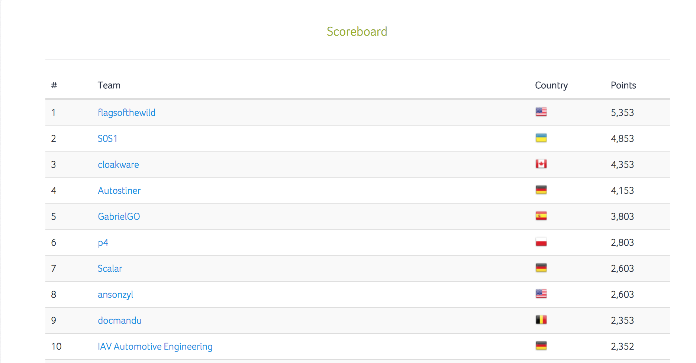

The team set out nearly a year ago to enter and compete in RHME3; when it was suggested that we submit a team for a prequals the 1st week of August. This was a busy time when team members couldn’t spend enough effort on the prequals and despite team members spending their family vacation time on the challenges, we were unsuccessful in securing a spot by the closing deadline of August 28th.
 
There were a couple second-chance entry opportunities though: we submitted to Liveoverflow video blog which was doing a giveaway of RHME3 boards for entry (no joy) and we also submitted a radare2 solution to an r2con competition which was also doing a giveaway. Anyone who could submit a writeup showing how to use radare2 to solve the 'antir2’ challenge would get a board. The team worked a solution and submitted it -- this is now listed under "Write-up by Irdeto team (Jonathan Beverley, Colin deWinter, Ben Gardiner)” at https://github.com/enovella/r2con-prequals-rhme3/tree/master/re); however, we then heard back that this r2con qualifier was open only to attendees of the conference — even though the announcement didn’t state this. We pressed and were told maybe, but nothing firm. The posted start date for the challenge came and went; we thought we were out. Over Xmas we noticed the Riscure twitter feed showed progress towards finally shipping RHME3. https://twitter.com/Riscure/status/943817050690084864


We still had a chance! We kept bugging them via email and eventually we did get a target board in the mail. We would start 3 points behind others in the competition but we would be *in* the competition.

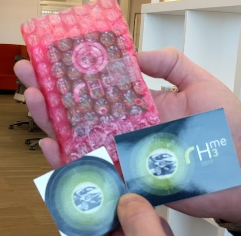

What follows are the writeups of the 16 challenges we completed (and some that we didn't). Here's a couple of our favourites:
* Full Compromise — Even when proper input was given to the device, it would verify the input for 6 hours before returning the flag
* Car Key Fob — Bugged challenge, unsolvable. Our writeup describing exhaustive coverage of what we attempted spurred the organizers to identify that they were testing a binary different than what they had deployed. They gave us a backdated solve to give us first solve on that challenge. Elapsed solve time on our part was multiple months.

The cloakware-ctf team was composed of (alphabetically) Jonathan Beverley, Colin Dewinter, Koos Ellis and Ben Gardiner. However, this does not include the long list of people who have helped in one way or another during the multi month challenge: many colleagues at Irdeto gave us their time (and sometimes tools) over the course of the competition. And we also received a little help from some friends externally too (named with approval): Matt Carpenter, Colin O'Flynn, Joe Grand, and Tom Hughes. Heartfelt thanks to all for your assistance over the past months! And also we would like to express special thanks to the support of our leadership at Irdeto for supporting us and committing resources to make competing possible.

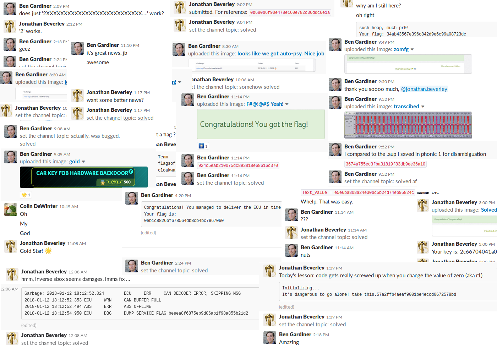

# Categories
## [Reverse Engineering](#reverse-engineering-1)
  *  50 [Ransom](#ransom-and-ransom-20)
  * 150 [Ransom 2.0](#ransom-and-ransom-20)
  * 250 [Full Compromise](#full-compromise)
  * 500 [Car Crash](#car-crash)

## Exploitation
  * 100 [Unauthorized](#unauthorized)
  * 200 [Bluetooth Device Manager](#bluetooth-device-manager)
  * 750 [Climate Controller Catastrophe](#climate-controller-catastrophe)

## CAN Bus
  * 150 [Can Opener](#can-opener)
  * 250 [Back To The Future](#back-to-the-future)
  * 500 [Auto-psy](#auto-psy)

## [Side Channel Analysis](#side-channel-analysis-1)
  * 200 [It's A Kind Of Magic](#its-a-kind-of-magic)
  * 350 [The Imposters](#the-imposters)
  * 500 [Random Random Everywhere](#random-random-everywhere)

## Fault Injection
  * 300 [The Lockdown](#the-lockdown)
  * 500 [Benzinegate](#benzinegate)

## ¯\\_(ツ)\_/¯
  * 100 [Race Of A Lifetime](#race-of-a-lifetime)
  * 100 [Phonic Frenzy 1](#phonic-frenzy-1)
  * 200 [Phonic Frenzy 2](#phonic-frenzy-2)
  * 500 [Car Key Fob Hardware Backdoor](#car-key-fob-hardware-backdoor)

# Reverse Engineering

## Bootstrapping XMEGA Static Analysis in IDA Pro

At the beginning of the challenge, we had some fun 'bootstrapping' our ability to reverse-engineer XMEGA code. Our initial experience with both IDA Pro and radare2 was that the disassembly was sane, but what we really wanted was cross-refs. Especially desired in the beginning was cross-refs to the serial ports memory-mapper registers -- that way we could really start to understand where the `ransom` binary was making calls to printf. As we struggled with creating IDA Pro databases that had useful cross-references we also found how to get function signature matching working. Then later as we improved on reverse-engineering XMEGA code, we also created a way to have stack variables in our IDA Pro databases too.

Atmel come Microchip publishes specifications for most of the programming interface of their microprocessors as xml files, so-called `.atdf` files. Parsing these files to create useful IDB databases is an idea we stole shamelessly from a few cases of prior art:
  * https://github.com/abcminiuser/gdp/blob/c15f7f7bc545c321bd9956f0701e628b170e047f/devices/device_atmelstudio.py
  * https://github.com/wrightflyer/test/blob/fd17c7e0810f2fede0fd658406144d578b531b58/avrread.py
  * avrports.fsx from the [radare2 github issue on xmega](https://github.com/radare/radare2/issues/5268#issuecomment-240503931)

The script we created, `avr2idacfg.py` started from modifications to the `avrread.py` script by Cliff Lawsom. Whereas his script creates header files, our script creates an IDA `.cfg` file which needs to be installed into `./~idapro/avr2idacfg.py`. At which point, a new target will be available when opening a `.hex` file in IDA.

This `.cfg` is really useful to name some of the memory addresses and interrupt handlers in the `.idb`; but there are some quirks of the IDA ATMEGA target when it is applied to an XMEGA target. First up is the fact that the XMEGA doesn't have the register file mapped at 0x0 in RAM but the ATMEGA target module of IDA is forcing naming these locations. I think it would have been possible to write and compile a new target module for IDA, but we hacked together some python to fix up the quirks of XMEGA on the ATMEGA target module: `fix_IDA_xmega128a4u.py` We ran into one weird quirk which we needed special handling for, but we were able to also capitalize on: the first 0x20 bytes of RAM can't be renamed from the `r0`, `r1`, ... given to them by the IDA target module to the ioport names that they actually correspond to in XMEGA because the names of these addresses are used as the register names in the disassembly. So we just added a comment on the address indicating what ioport it corresponded to. But, since the names of the addresses get used for register names in the disassembly, we were able to get some nice sugar in our disassembly: renames of the X, Y, Z data vectors `XL`, `XH`, `YL`, `YH`, `ZL`, `ZH` -- the script `avr_data_vector_names.py` takes care of this.

We originally wanted to be able to leverage `idascript` to process the .hex files at the command-line in batches. But IDA requires user interaction for the XMEGA target arch. But the scripts were all written as `idascript`s anyways.

Now, since we're analyzing flat binary files (even though they are ascii-encoded .hex files) we will get best cross-reference results when we create segments for RAM and copy the DATA segment there as is done by the early loader-loops in pretty much all flat binaries like this; these steps can be done manually in IDA by adding segments and loading additional binary files but the process is fragile; we automated the steps in the `avr_loader_loop_copy.py` script -- which also handles the difference in the addressing of ROM and RAM in the ATMEGA target module of IDA. Using it will require a small amount of reversing the target to find the loader loop and extract from it the start and end addresses of the copy loops via some basic manual analysis.

Then we could finally get to some xrefs. We weren't really sure that we could quickly implement any analysis passes to calculate the contents of data vectors at the time of a load instruction; so we settled for calculating the data vector contents at the time that they are populated and making xrefs at that position. The code emitted by the compiler in all the challenge binaries we looked at tended to always populate the data vectors by sequentially loading pairs of immediates into the register pairs. i.e. `ld r(X-1), #imm; ld rX, #imm`. The script `avr_dumb_seq_load_xrefs.py` takes care of that. These xrefs aren't perfect: they are associated to the line, not the arguments of the disassembly; so renames of the target of the xref requires a fixup pass of the source of the xrefs to correct for the new name, and there are helper functions in there to invoke in that eventuality.

An important step to take before unleashing auto-analysis on a flat binary file is to change the data type of the contents of memory to a default word size. This is embodied in the `codatafy` script by Craig Heffner. We created a similar utility script for our purposes: `avr_codatafy.py`

Finally, after quite some successful reverse engineering using the above scripts (and the signature matching approach detailed below) we ran into difficulty keeping all the local variables straight in the larger functions that needed to be reversed. The good news was that, in the compiler optimization level Riscure delivered us for the challenges, the stack frame was always set in data vector `Y`. We wrote a script to look for offset loads from `Y` and create local variables at those locations in the script `avr_stack_vars.py`

Using the above we could get very reasonable disassemblies of the .hex files; but we also wanted to avoid duplicating effort so we searched for ways to make signature matching work. We discovered that it can't be done with FLAIR/FLIRT through a hexrays forum interaction. We tried also the rizzo signature matcher from Craig Heffner, which did not perform well. But zynamics BinDiff did perform quite well. The only caveat was that it would only work in IDA 6.95; whereas IDA 7.0 was the only version that would import all the DWARF debugging information from XMEGA ELF files. This is relevant because to seed our analysis with some known functions, such as printf, we took the whackamole project from RHME2, built it with Atmel studio (tweaking flags to get the emitted assembly to match the patterns we saw in the atarget binary) and then analyzed the resulting ELF file to get 'signatures' (via bindiff now)' for the common functions. Due to the quirk we needed to export all the names in a 7.0 idb into a 6.95 idb. But from then on we could check for library functions by using bindiff against that 6.95 whackamole idb and we could import previously analyzed functions from other challenges by similarly using bindiff against those IDBs.

For an example of how to use the collection of scripts, [`atxmega128a4u/scripts/`](atxmega128a4u/scripts/README.md)

## Dynamic Analysis

It was possible to use the Atmel Studio simulator. The .hex files could be converted into ELF files within the 'Device Programming' dialog of Atmel Studio and a 'simulator' could be selected instead of any physical debugger tools. It seemed like using dwarfexport would have been possible to get ELF files with symbol information exported from IDA into the Atmel Studio simulator debugger; however, we never actually tried to get this working, settling instead for comparing the two windows side by side for the times when we needed dynamic analysis.

We also did purchase some ATXMEGA128A3U chips already soldered-onto breakout boards as well as an Atmel ICE3 debugger. The A3Us turned out to be good choices for executing the clear firmwares, we were able to similarly use Atmel Studio to run .hex files on these targets via the ICE3. The ICE3 was a poor choice of debugger/programmer since only Atmel Studio was supported and not avarice or other more-open debugging bridges.

## Simulation

We simulated many of the provided .hex files using Atmel Studio. The simulator can't use .hex files, only .elf files, but it has a utility that can convert .hex files into .elf files. Here's the steps:
  1. Tools -> Device Programming -> Simulator / ATxmega128A4U
  2. Production file, Save to ELF production file, Flash: <target>.hex
  3. Tick the Flash box
  4. Save

And then to actually simulate:
  1. File -> Open -> Open Object File for Debugging
  2. Select the Object File To Debug: <target>.elf

The simulator is awful. Useful notes:
  * You can type in equations into the "jump to program address" bar at the top. If you want to check out sub_632, type in `2*0x632`, that'll put you where you want to be.
  * Similarly, type equations into the watch window. You'll often want ones like `r24+256*r25`
  * You can modify program memory in appropriate pane, but it's often easier to patch the .hex file using IDA or the .elf file using r2.
  * When searching for help, know that Atmel Studio is a modified version of Visual Studio, so the resources for the latter often apply.
  * The simulator is _WAY SLOWER_ than the actual board. I'm estimating a factor like x10000. Serious. Many challenges incorporate anti-FI checks and anti-RNG-pinning checks that will take literally hours in the simulator. Patch them out before you start.
  * Serial I/O just doesn't work. Set a breakpoint on print functions and a watch on the place the string will show up.
  * For input functions, break just before entry and manually key the desired string into the buffer the function will populate.

## Ransom and Ransom 2.0
[Detailed Notes](ransom/notes.md)

This is the most straightforward reverse engineering challenge. Our RE framework wasn't very solid at this point, so the notes aren't as detailed as later challenges. We defeated primarily by simulation. The challenge takes a userid (that the board will print out on serial), and derives an unlock code from it. The .hex file we're provided doesn't have the userid included, so we waited until it read it out from EEPROM, and overwrote it with the code the board printed out.

Continuing the simulation, we captured the 16 byte stream the program derived from the userid, and used that as the unlock code.

Note: The first version of the challenge had a bug in it where it would only check the first digit of the provided unlock code. Trivial brute-force would defeat that.

## Full Compromise
[Detailed Notes](full_compromise/notes.md)

This challenge is a pig, and there's no way it's only worth 250 points. Reading the binary, there's a couple obvious "hidden" functions in the main input parsing loop. First, instead of running a "test", we can run a "risc". There's no reason to do so. Maybe the infoleak described below was only supposed to be present in "risc" runs, who knows? Second, if you type a '*', you get put into a funny mode, that leads eventually to the `flag_4d15()` function.

How do we navigate that path? Well, let me tell you...

In reverse order:
  1. We need to have submitted the right code. We can easily get the right code by simulating the `init_hash_102acf_4709()`, and checking what got put there. (Notation note: that function will `init` a global variable named `hash_102acf`, and the function's hex address is `0x4709`.)
  2. The password we submit is "processed" by a function `process_password_47cc()`. Which is just a busy wait with a counter of 500,000,000. Truth. That BS takes about six hours to loop. Apparently someone was a _little_ concerned about bruteforcing. (A 250 **byte** long fully random password, WTF)
  3. And we have to enter that password using pulse dialing. It doesn't matter what character we send (other than '*'), what matters is the delay since the last character. If you want the first character to be 0xa5, then send 165 characters, then wait ~6 seconds for the character to be accepted. Dialing at this speed, it takes about a half-hour just to clock the passcode in. (Fortunately, the board echos out the password it received, so you can check for errors).
  4. As if that wasn't enough, there are 1000 binaries. You need to figure out which passcode to use...

How to figure out which binary? That's where the 'test' command comes in. This function bitbangs the contents of a pair of arrays out through the DAC. However, those two arrays are constant across all binaries. Further examination shows that of the 100 entries 10 are modified slightly by a random slice of an array called `randombits_102a6b[]`. That array's contents vary per-binary. Here's what we did:
  1. Programmatically run the "test" command 200 times, capture the results with a scope, and export the scope results to .csv files. (We did this using [AutoHotkey](https://autohotkey.com/))
  2. Use a script to extract 10 bit sequences from the analogue scope results
  3. Use another script to collate them into a 110 bit long sequence
  4. Use [simavr](https://github.com/buserror/simavr) to simulate the function that generates the "randombit" arrays, for all 1000 binaries.
  5. Find out which one matches the string we got from the board.

Ok, that's all in place now, all that's left is to simulate the correct binary, find out the code, pulse-dial it into the board, wait six hours and use `stdbuf -o0` so that we actually get to see the flag.

At the time that we took on this challenge, we had only one RHME3 board and needed to time-share: we let the 6 hours run while driving the board+laptop to a team member's home, but we forgot that critical point about buffered I/O. Thanks to the laptop battery, the flag was still there in the device file buffer!

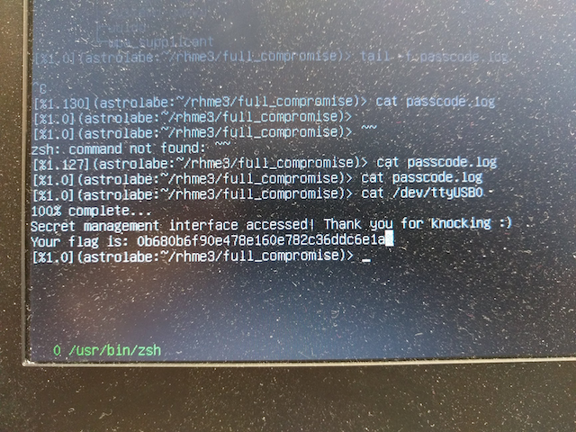

An easy 250 points. (lol wtf!)

## Car Crash
[Detailed Notes](car_crash/notes.md)

We have a simple command interface. Using it, we can print out the encrypted logs, and we can "decrypt" and print the "decrypted" logs. Only problem is, the "decrypted" logs are garbage.

Reversing quickly showed the existence of an unreferenced pair for the "decryption" function, meaning that the binary contains both encrypt and decrypt. I didn't recognize the algorithm, so I converted the disassembly into C, wrote a wrapper for it, and fixed it up so it built and ran. [Source](car_crash/crash.cc).

It didn't quite work at first, so I fired up the simulator, my code in gdb, and ran the two side-by-side and fixed my code to match the simulator. I did the same for the unused crypto function, by moving $pc in the simulator. Once I had an identically working copy in C, I reverse that instead of the AVR code.

Using a known plaintext, I reduced the algorithm to a single round, and printed all intermediates. I saw that in a round-trip, my plaintext->ciphertext->plaintext sequence diverged after the sbox step of decryption. Then I saw that some entries in the `inverse_sbox_102110[]` had been zeroed. Fixing that is trivial given the forward sbox, and immediately produced a clear decrypt of the logs.

# Exploitation
See [Reversing Engineering](#reverse-engineering-1) above for details. We followed the same procedure here.

## Unauthorized
[Detailed Notes](unauthorized/notes.md)

Initial reverse engineering showed the existence of a 'backdoor' account, with a 32 byte password hash. Just in case, we threw hashcat at it, but got no results.

Working backward from the flag printing function, the code searches through the list of configured users, if it finds a match, checks that the hash of the password matches the hash in the list using `strncmp()`, and if so prints out the flag. Rather than reverse the hash algorithm, we simulated it, giving it a known password, and checking the result against known algorithms. Unsurprisingly, it was off-the-shelf SHA256.

With this understanding in place, we went looking for a place to exploit. The only place our input is handled is in the function we named `parse_and_maybe_set_flag_printer()`. It does a bizarre dance summarized below:
  1. `alloca()` space for the two numbers, `memcpy()` them over and `strtol()` them.
  2. `alloca()` space for the password, but do nothing with it yet.
  3. `alloca()` space for the username, `memcpy()` it over, and search the list for a match.
  4. If it finds a match, `memcpy()` the password over, hash it and compare.

The code checks whether the numbers we submit are negative, but it doesn't check for int overflows. Which don't match, but gave us the right idea. By claiming the password is unusually long, we can cause the stack to grow until it overlays the heap. With a carefully chosen value, the value we submit as the 'username' will be written to an arbitrary place on the heap.

Using this, we choose a new password, hash it, and overwrite the backdoor accounts password hash with our hash. Then we log in. Flag.

## Bluetooth Device Manager
[Detailed Notes](bluetooth_device_manager/notes.md)

In this challenge, we get to interact with a simple interface that allows us to configure and modify a list of "connected" devices. This challenge took me much longer than it should have, because I didn't pay attention to exact function of the `brcc` and `brcs` opcodes. There's an off-by-one error in the function we named `broken_read_str_until_13b()`. Just from initial analysis we knew that it didn't always null-terminate, but thought that was it.

Also, we read the victory string: "such heap, much pr0!", and guessed that it might be an attack on `malloc()` or `free()`. I'd recently done a challenge where a broken `malloc()` implementation was the target, so I ended up fully reversing both those functions, to no avail. That was dumb. In the context of this challenge, I should have compared them to the known-good versions in other levels. It's not like Riscure would have deliberately left such a vulnerability in all levels.

Once we identified the correct vulnerability (the off-by-one error), we realized what that meant. The ability to overflow heap strings means the ability to modify the malloc entries between the heap strings. Details are in the linked notes file, but the summary is:
  1. Create heap strings A, B, C, D
  2. Delete B
  3. Overflow A to modify the size of B in the freelist, so that it overlaps with C
  4. Create a padding entry in the formerly-B-freespace to use up some
  5. Create a payload entry that overlaps the part of C. that contains the struct
  6. Write to the element created in 5 to alter where the struct points
  7. Write to C to write where the struct points.

All that done, we just need to tick the relevant boxes. Write `0xBAADF00D` to the relevant address, and overwrite a return address with the victory function.

## Climate Controller Catastrophe
[Detailed Notes](climate_controller_catastrophe/notes.md)

At 750 points, we expected this one to be rough, and we were not disappointed. We start the challenge out with one **major** hint. The organizers provided us with a .hex file that will wipe the contents of the EEPROM. Immediately this suggests to us that we can brick the challenge by writing bad values to the EEPROM, which turned out to be true. Going with this, we need to understand how we can write to the EEPROM, and how the board will react to the contents of it.

First things first, we need to interact with the board. The serial line just prints out some initialization messages then goes silent. No amount of prodding there produces a result. Breaking out a logic analyzer, and probing all the A# and D# channels, we saw traffic on D7, D9, D10, D11, and D13. Checking out the [board schematic](atxmega128a4u/resources/riscurino-1.0 - Schematics.pdf), we found that most of those lines are inputs to the CAN controllers. We spent a little while fuzzing the CAN interface, but got nothing. So instead, we read the SPI traffic on board init. From that we learned that it was masking all traffic except from a couple SIDs like 0x665, and was running at 100 kHz. Cool, we have interaction.

At this point we spent about a week reverse engineering the .hex file. Here's a list of the things we learned:
  * It accepts CAN traffic from 0x776 as well as 0x665
  * The flag printing function isn't called from anywhere, we're going to need to gain control of $pc.
  * Before we invoke that function, we need to set global variable `must_be_1337_10210A` to 0x1337, or else the flag will be masked.
  * There's a global we called `eeprom_write_lock_1020f0` that controls write access to the EEPROM. We need to satisfy a "Diffie-Hellman" challenge to get it.
  * They did DH wrong, the equation is `C = R^E (mod M)`, solve for 'E', but they ask us to solve for 'R'. To solve that all we need to do is factor the modulus, and use a well-known algorithm.
  * The "certificate" we can upload to EEPROM needs to satisfy a very particular format or else it will be wiped and replaced by the default.
  * We need to mark the EEPROM cert as "uninitialized" so that it gets parsed on startup.
  * The function `cert_check_valid_6297()` is called with a length 0x100 buffer, but internally it uses three length 100 buffers. The opens up an overflow of the third.

With the overflow point established, we need to build a ROP chain that will set `must_be_1337_10210A`, and invoke `print_flag_or_die_4E8F()`. The easiest target I saw was to return to the tail of an ISR, which is going to populate almost all of the registers. Once we had that, and a function like `sub_34e2()` that invokes `memmove()` near its return to get our write-what-where, it was all over.

Result: a board that prints the flag to serial on boot, every boot.

Funny story: The INT0_ ISR that we used for our first ROP gadget sets `r1` along with so many other variables, and I stuck `0x31` there as a placeholder... code starts to act _real strange_ when you change the value of zero...

# CAN Bus
All these challenges, (and [Climate Controller Catastrophe](#climate-controller-catastrophe)) use the CAN interfaces as a primary method of communication with the firmware on the board. The board has two CAN controllers, which are cross-linked through an on-board CAN bus, which is helpfully exposed through the DE9-ready ports near the barrel jack. The CAN controllers are programmed through SPI, which can be sniffed through the high D## ports.

Later on, we cut the traces connecting the two CAN controllers, and plugged a CAN2USB adaptor into each, then used an [ugly python script](back_to_the_future/ugly.py) to bridge the two. This allowed us to isolate them and test them separately, without their cross-chatter interfering. Note that since the whole system of "ECU"s is emulated in software, we need to have a CAN adaptor plugged into each side, or else the board will stop responding.

## Can Opener
[Detailed Notes](can_opener/notes.md)

This challenge really is a "CAN opener". The whole challenge is the following three steps:
  1. Connect to the CAN bus
  2. Observe one ECU sending regular 0x332 "lock\0\0\0\0" messages
  3. Send a 0x332 "unlock\0\0" message
Done.

## Back To The Future
[Detailed Notes](back_to_the_future/notes.md)

This challenge relied on the split CAN bus. Without it, conflicting speed messages kept preventing us from pinning the speedometer.

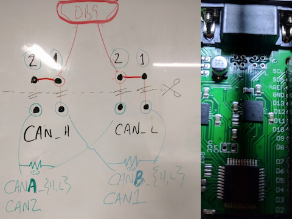

If we saturate the bus enough that conflicting messages don't get through, we trip error states. So to pin the speed, we have our bridge script alter every speed message it sees to 88 mph.

That still doesn't work, because something is triggering the "check engine" light. From outside experience, we know that that light often is a generic "something is wrong" light. To find out what's up with it, we tried every message we saw and several variants of them to see what toggled the engine light off. Eventually we found that the 0x19a message was it. We didn't find out what it meant, or where to put it, so instead, we fired one off every time we saw any message. That was enough, and a few seconds later the flag fell out.

## Auto-psy
[Detailed Notes](auto_psy/notes.md)

Just by reading the description, one member of our team nailed exactly what this would be. [UDS](https://en.wikipedia.org/wiki/Unified_Diagnostic_Services). Our expectation was that we'd need use $27 to enable a security session, and then use $23 to dump the "key" from RAM. That's close, but not quite right...

Connecting to the CAN BUS, and just listening, we see queries to 7DF, and 7E5. The former is like a broadcast request, intended to be used by a piece of diagnostic equipment. When send our own ODB-II request to that address, asking for ECU Names (Mode 09, PID 0A), we get the following list:
    * 7D3/7DB: FlxCap_Ctrl
    * 7E0/7E8: FlxCap_Gateway
    * 7E5/7ED: FlxCap_PwrTrain_Ctrl

(We also get the VIN: LJCPCBLCX11000237, which might be the Bat Mobile?)

Now we know who's out there, it's time to do some SID enumeration to see what they're going to respond to. Note that only low PIDs respond to requests on 7DF, to talk to SIDs, we need to use the correct CAN id, so we have to hit each of the three one at a time. Fortunately, it turns out that the parser and error detection are fairly well written, so we get useful error codes back. From them, we learn that the following SIDs are enabled:

* $10 Diagnostic Session Control. Set to `0` to be boring, or ``11`` to enable other SIDs.
* $11 ECU Reset
* $27 Security Access
* $35 Request Upload. Note: "Upload" means it sends to us.
* $36 Transfer Data
* $37 Request Transfer Exit
* $3e Tester Present

First, the ECU needs to be set to "Programming Session", using a $10:2 message, then we go straight for $35, and get hit with a response ``0x33 securityAccessDenied``. Expected, but we had to try. That done, it's time to do things the obvious way. A $27:1 message receives a two-byte seed value back, a few quick tests show it expects a two-byte "key" back (it gives error ``0x13 incorrectMessageLengthOrInvalidFormat`` otherwise). Two-bytes is 65536 possibilities, or about four hours of brute force. The [security-access.py](auto_psy/security-access.py) script automates this. It ends by going into a loop that sends a $3e message every ten seconds to prevent the session from lapsing, but later analysis showed that to be unnecessary.

Once in, $35 started working properly. The [rom-dump.py](auto_psy/rom-dump.py) script automates this process, iterating through the whole memory range and dumping 4k chunks. It doesn't handle errors well, and so provides bad chunks around 20% of the time. It's quick, so I re-ran it multiple times until I had full-sized chunks. A little stitching together, and we'd effectively added the **RE** tag to the challenge.

Analysis quickly showed that SID a $A0:0 to 7D3 should drop the flag:
```sh
[0](~)> cansend can0 7d3#02.a0.00.22.30.00.00.04
can0  7DB   [8]  10 29 E0 00 46 4C 41 47   '.)..FLAG'
can0  7DB   [8]  21 3A 00 06 00 00 00 00   '!:......'
can0  7DB   [8]  22 00 18 39 06 00 00 00   '"..9....'
can0  7DB   [8]  23 00 00 00 00 00 00 00   '#.......'
can0  7DB   [8]  24 00 00 00 00 00 00 00   '$.......'
can0  7DB   [8]  25 00 00 00 00 00 00 00   '%.......'
```
Nope. Except, we obviously did the right thing, because we got a valid reply starting with "FLAG"... Some more reversing showed there was a subtle bug in the code. The code that XOR-"decrypts" the flag gets it from ROM, XORs it, and tries to put it back in ROM. Because the ATXMEGA is a Harvard architecture, RAM and ROM address spaces both start at 0x0, so ROM:0x232 and RAM:0x232 both look very similar in binary, so what the code actually does is write the FLAG to a bunch of memory-mapped I/O, and then print that I/O out over CAN.

**However**, this image is the actual running image, not a sanitized one for RE. With a little more reversing, and judicious application of the simulator, the flag popped right out. Only problem? It didn't work.

A quick telegram chat and a little forehead-desk later I learned that I'd been working on the pre-bugfix image. OOPS. Fortunately, all the knowledge transferred over. There are only three notable differences:

1. The RAM/ROM mix-up is fixed so the flag will print properly.
2. The Flag is zeroed out of the uploaded image (likely that there's two images, one running, one for download)
3. 7D3/7DB is input masked.

In combination, the latter two break the attack, and they mean that 7D3#$A0:0 isn't going to work. It's possible there's an exploit in the binary that could be exploited to get access anyway, but after spending the better part of a week trying and failing various paths, we decided on the one that had to work: We'd   patch into the SPI bus disable filtering ourselves.

Then we woke up the next morning and had the flag. It turns out the organizers had decided that extracting the previous flag from the image was good enough for full points.

# Side Channel Analysis

Setting things up for side channel analysis was an awesome part of this challenge. One of our team members is a sucker for PCB re-work and so got to flex that muscle alot (maybe too much) in this phase. We warmed-up with a single VCC shunt on the riscure-provided uVCC header on the RHME3 and eventually reworked everything to the point of SMA connectors on two boards, one GND shunt and the other a VCC shunt with AVCC of the XMEGA separated.

It was clear that riscure gave us a handy jumper for VCC/uVCC on the RHME3 target, but we noticed that this layout yieled combined measurement of both the VCC and AVCC pins of the XM EGA -- which is different that the very-nice documentation provided by the ChipWhisperer project of [its target board CW303](https://wiki.newae.com/images/a/a7/Cw303_schematic.png). We elected to do some more rework of the RHME3 target, planning for both VCC and GND shunts.


Because of the multiple points where VCC and GND are connected to the package, and uncertainty about the layout (could we actually just cut the traces leading to the legs of the package?) it seemed like we needed to go whole-hog and lift the pins. Because of the proximity of the VCC and GND pins on the XMEGA package (see red and blue marks in the picture below) on the RHME3 target, we really didn't think we could safely pin-lift to do both VCC and GND shunts at the same time. At this time in the competition we had only one target, we picked the VCC shunt method and went for it.

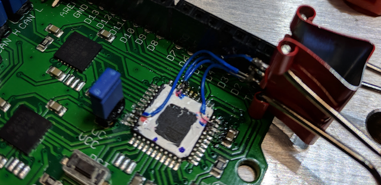

It worked, in the sense that the system didn't release magic smoke after the rework. First up on our list of things to-do was figuring out how large a value of resistor we could put in series with the chip. We knew from RHME2 writeups that the voltage thresholds and Brown-out-detect would be setup for continuous monitoring -- we wanted to make sure that whatever signals we would get from the board would be of the largest amplitude possible.

We observed, by powering the target with a bench supply, that the system would not boot if the voltage supplied was beloew 2.76V, also that after boot you could reduce teh voltage to 2.73V. At either of those limit cases the target would clear the target firmrware but never cleared the bootloader (lucky for us). We set out to find the largest resistor (of those I had on-hand) which would still let the target boot.

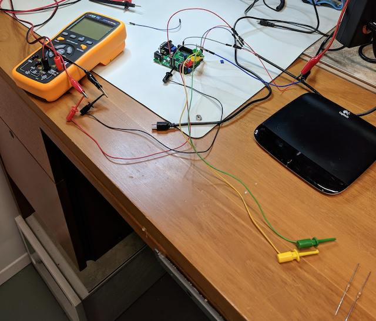

A 10R was the largest value we could use.

Next up, we wanted to make sure we had a low noise floor, free of harmonics. We reasoned that we should power everything from USB battery packs, both of the ones our teamates had looked very free of harmonics. Rather than messing around with bleeding power through the USB adapter on board etc we just elected to make (what the internet told us was) an illegal calbe: splitting power from data.

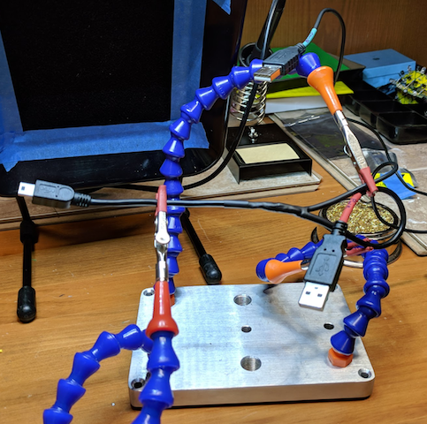

There were a few more pieces to the setup: a picoscope 3000, a JTAGulator which we re-programmed to be our trigger generator on serial traffic. The results were OK, and probably would have been sufficient but we weren't capturing any flags yet.

We were gifted a second RHME3 target by a friend (please see thank yous in the intro) and this enabled us to also try a GND shunt to see what (if any) difference it would make. It ended up being just-about as good...

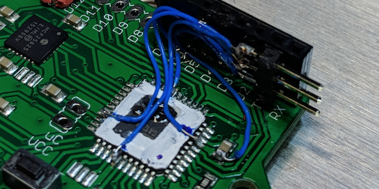

Then we got a differential probe from NewAE Tech; we re-worked it (as it was designed to be) so that we had a 10R shunt resistor on the diff probe and connected that up to target:

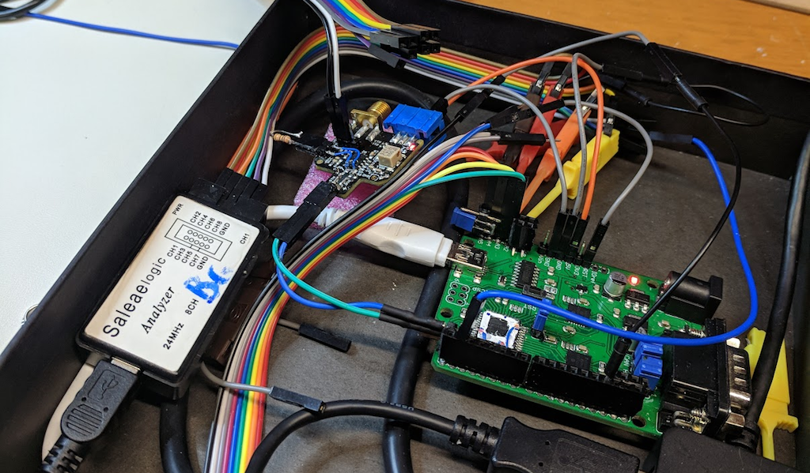

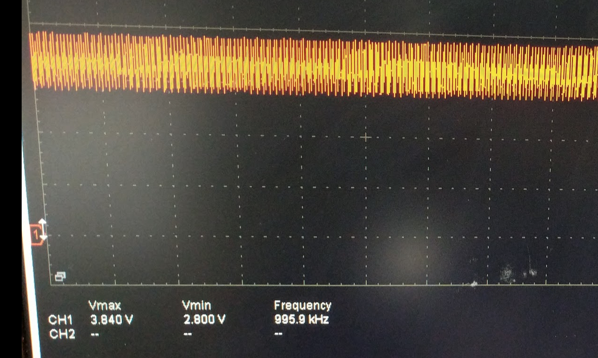

The signal quality was much improved and we were starting to get really close to some flags (see below in the writeups sections for each challenge for more details).

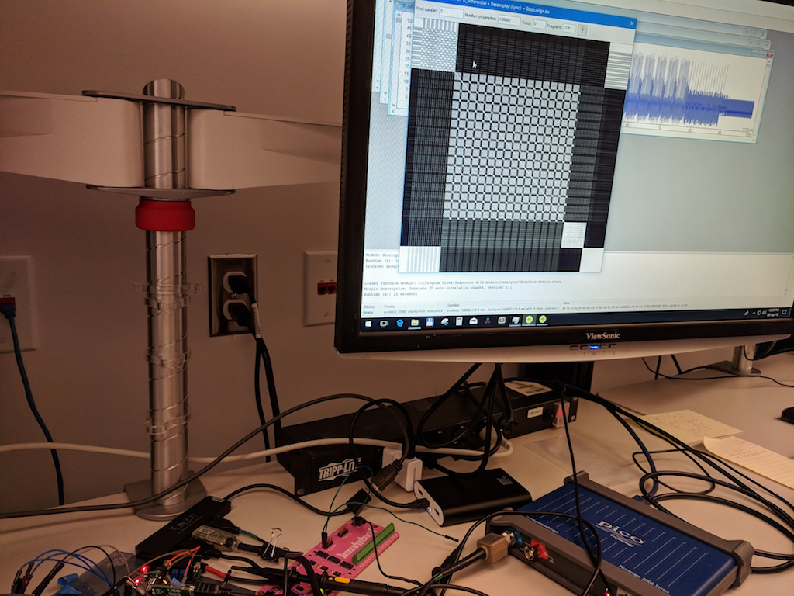

#### Things That Didn't Work

Of course, the above description of the setup is very 'linear' and does not capture the reality of the many many mistakes we made along the way. In this section, we'd like to examine some of the things that didn't work for us.

* Changing the Brown-Out-Detect (BOD) settings: We were a little worried about fatally corrupting the fuses on the target, so we never even tried this until the last day. We could read the fuses settings with Atmel Studio and an ICE3 debugger; the values mostly made sense with the rest of our experiments. But (obviously) we weere not able to change the settings.

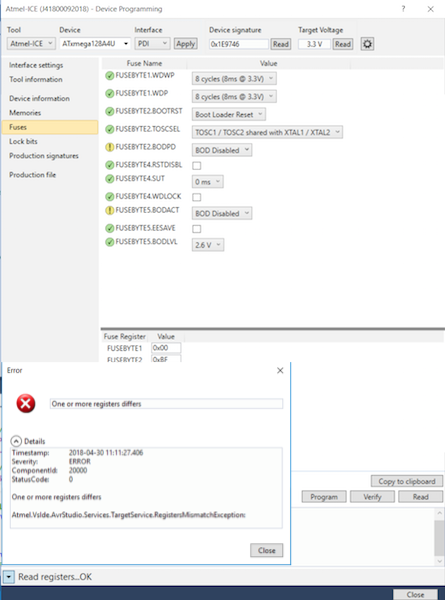

* Clock Injection: Inspired by https://www.cl.cam.ac.uk/~sps32/JCEN_sync_sca.pdf we setup our ChipWhisperer as a clock generator and connected that to the XMEGA through a passive adder, where the VCC shunt resistor was the other leg of the adder. Then we  used the CAN Opener target firmware, which did enable the generation of an external clock signal for CAN_CLK, so we could observe if we ever got phase lock from the XMEGA onto the injected signal.
  * different rails: we tried both AVCC, VCC and both AVCC+VCC pins of the XMEGA
  * different harmonics: we tried searching for useful injection frequencies around x1 x2 and x4 of the XMEGA clock
  * different modulation amplitudes: by changing the resistor adder leg as input of the injected clock (recall that the other leg was fixed because a larger value than 10R would cause a reboot) we tried various modulation amplitudes. At one point we did observe a lock, but it also triggered BOD !

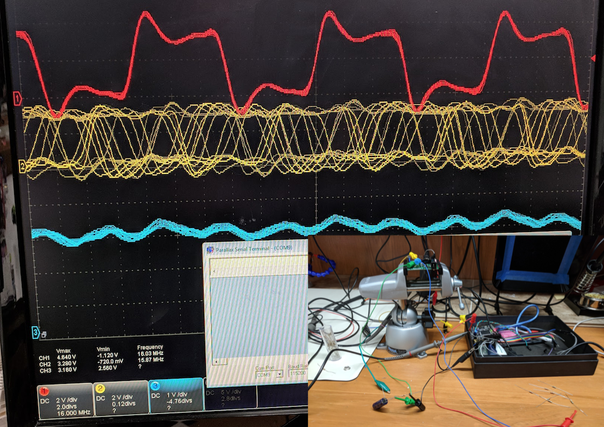

* Inspired by https://www.cl.cam.ac.uk/~sps32/JCEN_sync_sca.pdf We got a bare clock recovery board from NewAE tech and set out to get synchronous capture of our traces by doing clock recovery of the XMEGA target. We made quite a few mistakes along the way and despite plenty of help from friends (please see the intro section for thanks) we never did get clock recovery working on this target
  * ordering 0402 instead of 0603 components (still assembled it anyways, just with extra cursing)
  * ordering very very crappy decoupling caps
  * not accounting for parasitic resistances in the filter design
  * and as-yet unkown causes...


But, don't get us wrong, these were all valid experiments and valueable learning experiences. We're glad we tried them out even if they didn't pan-out.

## It's A Kind Of Magic
[Detailed Notes](its_a_ko_magic/notes.md)

[Jlsca Notebook](its_a_ko_magic/rhme3-itsakindofmagic.ipynb)

From the challenge description, we (accurately) guessed that there was simple XOR masks on both input and output. Round-trip encryption/decryption cycles work, but not across reboots. That suggests the masks are randomly generated on boot. Next we used the excellent autocorrelation feature of the Riscure Inspector tool.


Now, I want to talk about the above image for a while, but autocorrelations are awesome, but not well explained. Contrary to what my labels on the image suggest, execution is on the diagonal. Every instant is perfectly correlated to itself, so we get a solid white diagonal line there. The square blocks we see on the diagonal are loops. In loops, the chip does the same thing over and over again, so each loop correlates well to all the other iterations. Note that even substantial differences in processed data don't have much effect. What's being shown here is what's being done.

With an unprotected software AES implementation like this, we can deduce what each part is just by counting. There are eleven AddRoundKey operations, ten SubBytes, and nine MixColumns. I've labelled the projection on to the left side because it was easier in Paint. I could have labelled the top, or (with a bit more work) the diagonal. Same thing. If you look a little more closely, you can see the MixColumns operation has a four-by-four grid structure. That's because MixColumns is implemented as a nested for loop.

To attack this implementation, we observe that there's no additional input or output masking step in the plot, and that there's no mathematical difference between XORing the mask to the plaintext/ciphertext, or XORing it into the first and last round keys of the schedule. Noting this, we do the equivalent of an AES-256 attack on this AES-128 implementation, because that involves capturing the first and second round keys. Then instead of trying to reconstruct an AES-256 key out of them, we throw away the masked first round key, and use the second one the derive the original key.

Check the notebook for a full walkthrough.

## The Imposters
[Detailed Notes](the_imposters/notes.md)

[Jlsca Notebook](the_imposters/rhme3-theimposters.ipynb)
                                         
This one took far longer than it should have. Power analysis showed sixteen identical "rounds", that looked kinda-sorta like AES, separated by large blocks of probably-RNG activity. Here's a zoom-in of a couple "rounds":

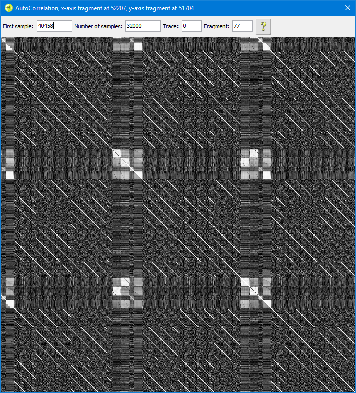

I spent way too much time under the assumption that ten of the sixteen rounds were real, and the rest were dummy rounds, randomly sprinkled in at the start and end to frustrate CPA. Boy was I wrong. It turns out that what I though was a single round was an entire **hardware** AES invocation. The first block is clocking in the key, the second clocking in the data, the little block is the actual AES, and the final block clocking out the data.

Honestly, I should have known. Doing a plaintext/ciphertext correlation with the traces showed strong spikes on a single "round", which doesn't make sense for a single AES round.

Once that misconception was squared away, we went hunting for information how to break the ATXMEGA 128A4U hardware AES implementation, and with a little help from a friend (see intro sections) we found a [ChipWhisperer tutorial on exactly that](https://wiki.newae.com/Tutorial_A6_Replication_of_Ilya_Kizhvatov%27s_XMEGA%C2%AE_Attack). Our ChipWhisperer was giving us grief, and implementing it in Inspector just wasn't coming together for us, so we turned to [Jlsca](https://github.com/Riscure/Jlsca). It is of course, a CPA toolkit written in Julia. Now, one thing needs to be said about Julia:

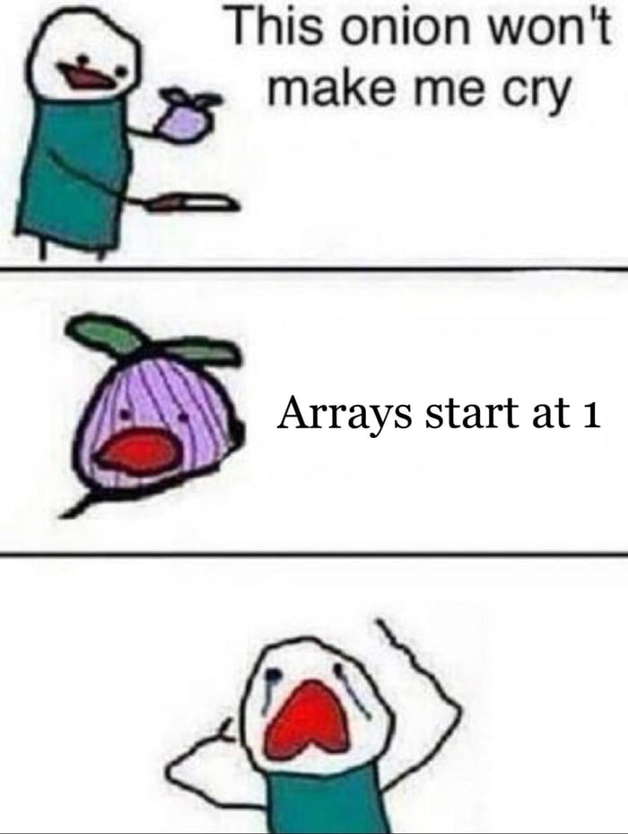

However, it does have its advantages, which is why We've got notebooks for both this challenge and the previous. In a couple nights of coding, we reimplemented Ilya's attack in Jlsca, (which I'll probably try to push to the [jlsca-tutorials](https://github.com/ikizhvatov/jlsca-tutorials) repo at some point), but until then, [the diff](the_imposters/jlsca.patch) is provided. Only one problem. No flag.

Days and nights were lost trying to figure out why, but eventually we settled on the only path we could think of. We wrote our [own version of the imposters](the_imposters/TI_KnownKey.7z), for a 128 A3U we had lying around.

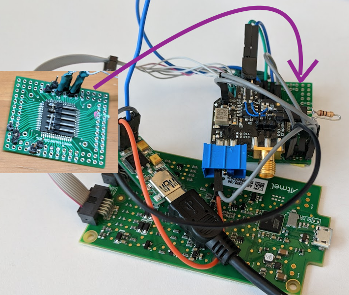

Then we started a known-key analysis on traces we captured from that. The breakthrough came a few days later, using Inspector, searched the whole area for correlations between plaintext byte 2 XOR keybyte 2 XOR (every other plaintext/keybyte pair). We got a clear, decisive hit, for pair 7 and pair 13. WTH? Regardless, we pressed on. Shortly we'd identified where all the correlations were, and suddenly it jumped out at us. ShiftRows. It's like they did ShiftRows at the beginning of the round, and then processed in that order. This is probably a hardware optimization to eliminate the cost of ShiftRows. Regardless, we got our known key, and shortly our flag.

Check the notebook for a full walkthrough.

## Random Random Everywhere
[Detailed Notes](random_random_everywhere/notes.md)

We didn't complete this challenge.

We didn't figure out what sort of masking was being used until very late in the challenge, and at that point, we didn't have enough time left to figure out how to find correlations in that. Part of this, was that we noted that Ilya Kizhvatov (author of the paper referenced in The Imposters), works for Riscure, and wrote the jlsca-tutorials repo. He also wrote a paper called [Analysis of the Split Mask Countermeasure
for Embedded Systems](https://orbilu.uni.lu/bitstream/10993/10582/1/splimaskanalysis.pdf) that seemed suspiciously similar. It was coincidence.

Back to basics:

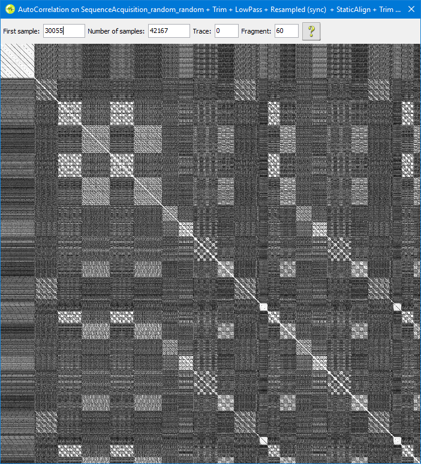

From staring at the autocorrelations (first round of encryption above), we knew a fair amount about what was going on. First, before the plaintext receives its initial mask (location known from data correlations), there's a strange block that looks like and correlates to MixColumns. We know that attacks on MixColumns exist, so this is probably to generate the MixColumns output masks. A thing we know has to happen, if you're going to mask that step.

Second, the RNG-like block at the very beginning (not pictured) iterates eighteen times. That's exactly enough for a 4x4 MixColumns mask, and separate SBox input and output masks. That nailed down, we can deduce that the small checkerboards around MixColumns are the input and output masking steps, and that the parts of the preamble that correlate with them are their mask generation. Which _strongly_ implies that the checkerboards near that mask generation, is the SBox mask generation. Knowing where that is, and where both AddRoundKey, and SubBytes are (mostly by counting), should be enough for us to launch a second order correlation power analysis.

Unfortunately, none of us knew enough about how second order attacks work to code one up in time, and no off-the-shelf solution seemed to map to our needs.

# Fault Injection

## Benzinegate
This is a simple CO exhaust level regulator. It sets the levels according to the regulations. Or does it? We suspect hidden functionality. Can you help us confirm?

This challenge represents both the largest leap in our current expertise (Fault Injection) while simulatenously making us feel the most Hackerman.


The challenge accepted a CO2 level as input, and reponded with "# Level Set".
Initial analysis showed that it was vulnerable to a buffer overflow in its input, which we can then ROP attack into the hidden functionality.
The issue is it wont print the flag unless the stack canary is correct.
If unsuccessful it will print some lovely XXXX's to let you know how wrong you are compared to the canary.

While they are doing the canary check, they raise an LED for a few micro seconds, giving us a viable trigger to sync our fault injection.
This path was named the "Happy path", and naturally made us very sad during the competition.

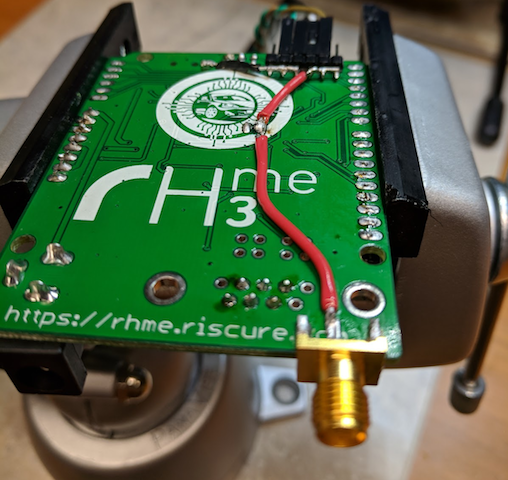

We prepared the victim for the operation, To avoid damaging the board, we believed pulling the power rail down to ground would be the best course of action instead of over-supplying. We started out with the cool ChipWhisperer (Lite) platform, creating a python driver for our target and configuring the CW to trigger a glitch at points in time which we tuned by overlaying non-glitched and glitched traces, then began running searches through the glitch-delay and glitch-width spaces.

Unfortunately for us, [there is a bug in the CW](https://github.com/newaetech/chipwhisperer/issues/90) which results in sometimes having the logic line which controls the FET on-board the CW get stuck active <-- which then causes the FET to continuously draw current. It was just our bad luck that we would run into this issue ever overnight run ! We had some burnt resistors and eventually damaged the FET on-board the CW.

We needed another option, we had some XMEGA 128 A3Us that we purchased to do dynamic analysis and known-key attacks. We repurposed one with a custom program to turn it into a variable delay single shot pulse generator and then connecting that to a FET. Raiding a discarded power converter we found a massive power mosfet that could switch in under 100 nanoseconds, the length of an AVR clock cycle.

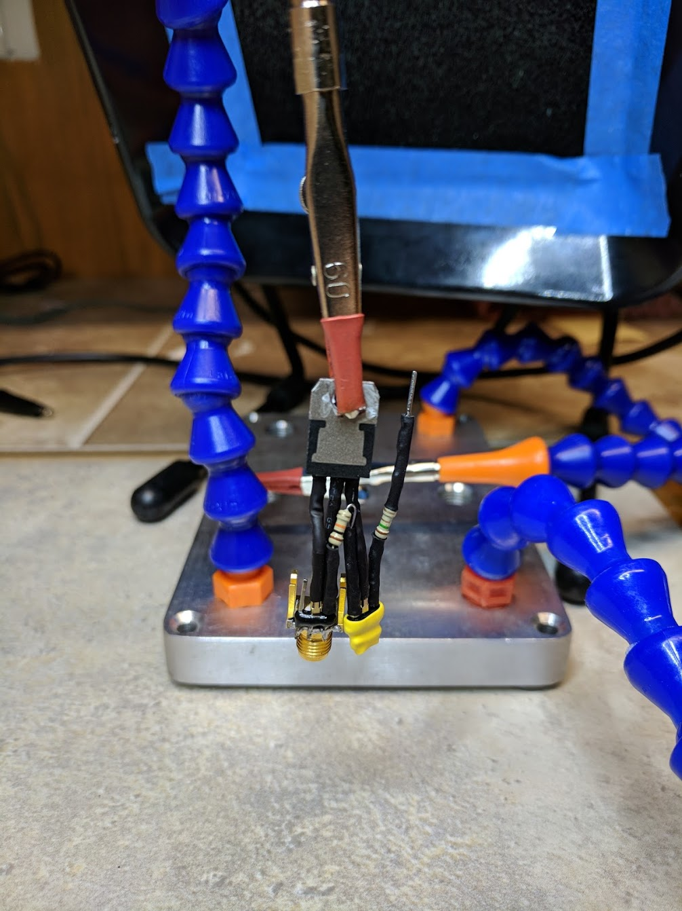

We connected the two of them together, thus sinking the device power rail low for fractions of a clock cycle.

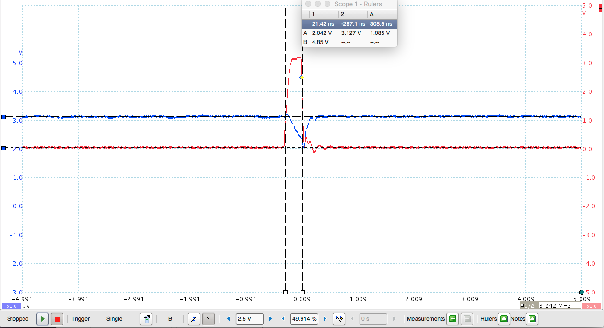

Since our timing involved adding and removing clock NOP() cycles after raising the pin high, our ability to tune the glitch was limited. But it had the possibility to work, so we pressed on. By combining persistence display on the oscilloscope and alternating glitch/don't-glitch runs we could manually tune the delay and width of our pulses, this is because the target firmware gave us a pair of nice nop-sleds to time the position of the glitch visually (or so we thought!). We needed to tune the delay to get the glitch into the right point in time; but we also needed to tune the width to be somewhere in between having no effect at all and causing the board to reset.

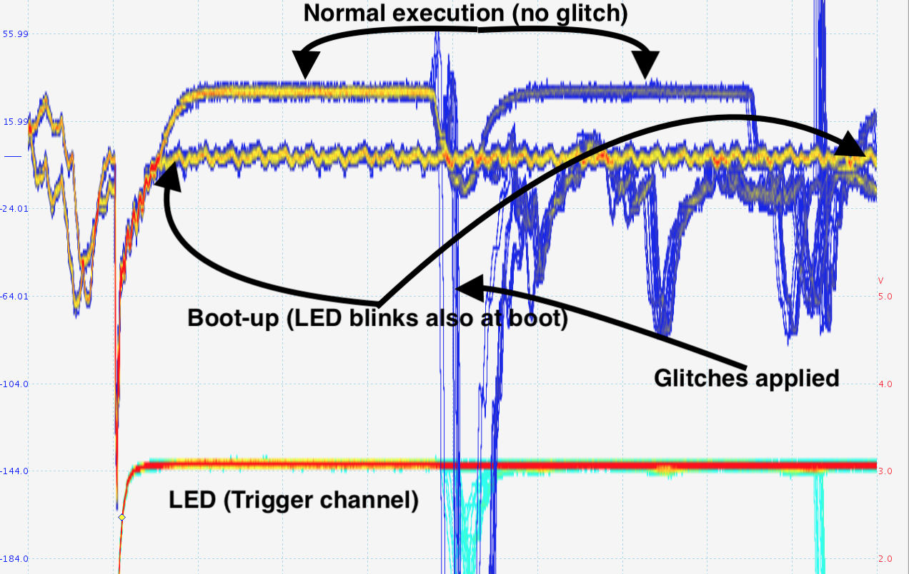

Through this method, we were able to successfully glitch a memory read on the amount of XXX printed. This is important because the variable that holds the amount of X's to print is checked against zero to print the flag.

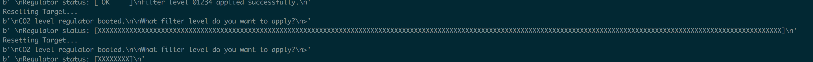

The value of X's fluctuated constantly, and luckily/heartbreakingly we did manage to glitch it to be happy path(0 X's)!

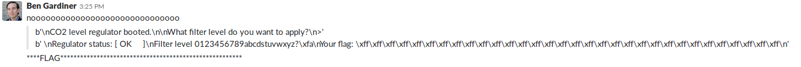

Alas, simply glitching the variable wasn't enough, we need to glitch an INSTRUCTION not a memory load. Most challenges have a Flag mask that need to be disabled, or else it will print out all 0xff's.

That occurred with a couple hours left to the competition; we did not know how we could get an 'instruction' glitch working. Were not able to get the branch instruction glitched. A sad end to this happy path.

## The Lockdown

Even though this was rated lower points than Benzinegate, our read of the target firmware (after it was released in the clear by Riscure) made us think that it would be harder to accomplish. The target appeared to require multiple glitches to get to the flag.

We focused on benzinegate because of the higher points and ran out the clock on that challenge.

We did not solve Lockdown

# ¯\\_(ツ)\_/¯

## Race Of A Lifetime
[Detailed Notes](race_of_a_lifetime/notes.md)

This is a simple "write a program that interacts with the board over serial". I suppose you could do it all by hand, but it would be way too tedious. [Script here](race_of_a_lifetime/race.rb). The most interesting part, was that you couldn't go too fast, but that degrees of longitude vary in size with latitude. So we had to get some code to correct for that.

We expected a bunch of curve-balls to be thrown during this challenge, but none of them came, so we drove, sailed, and flew our way to victory. (After once flipping the sign as we crossed the terminator, oops).

## Phonic Frenzy 1
This challenge introduced us to the high levels of trolling that we were to expect from future challenges. Don't get us wrong, we like trolling as much as the next person -- and we fell for it hard too.

After flashing the challenge binary we saw the serial console message "welcom[ing] us to the infotainment center" (thanks to phonic 2 I hope I never hear those words ever again in my life). We probed the board for other interesting signals and found interesting signals on D7, D8 and A[0..5]. The A signals are very much digital signals, of some unknown protocol. The D signals are very much analog, and look very much like audio (so much so that a son of one of our teamates called it, as well as another teamate -- though who called it first is still debated). Here's the first troll: there's digital signals on the A pins and analog signals on the D pins :)

We created our first bodge cable of the challenge and connected the D7+D8 pins to the mic-in on an old netbook.

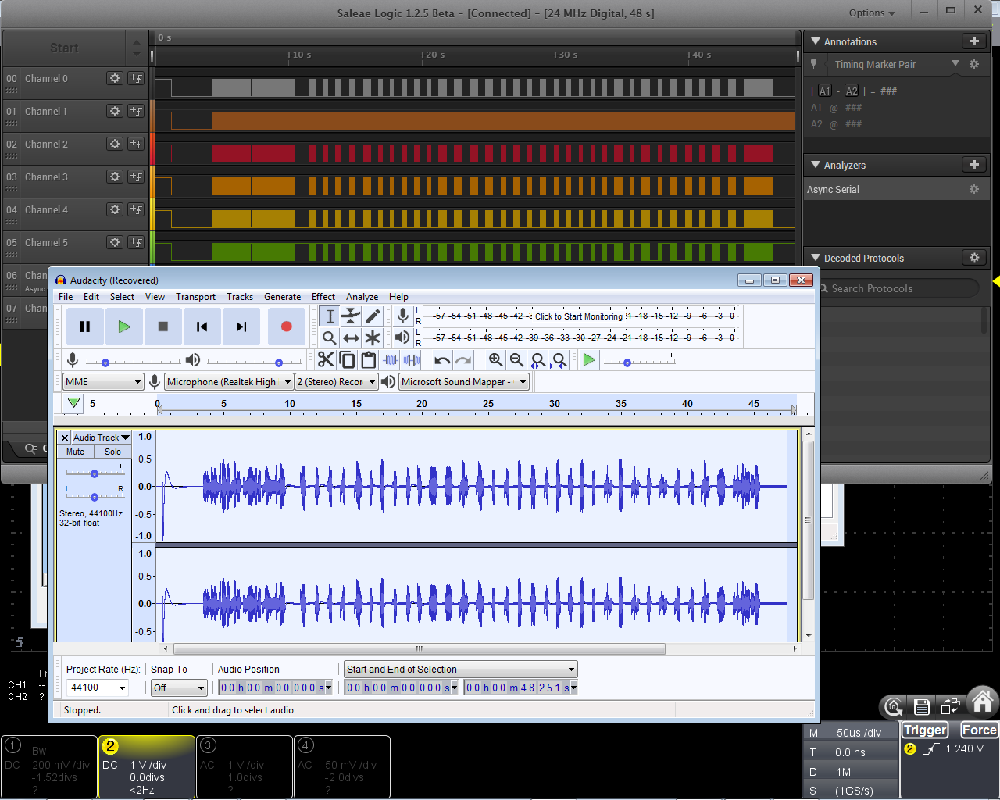

Audio quality was very poor; but it was clearly saying mostly the same text as what was printed on the serial console

```
Welcome to the Infotainment Center.
Please connect all components properly
and enter the serial number online to
activate your in-car infotainment system.
The system must be activated before proceeding.

Thank you.

The system will reboot now.
```

Except, before it said "the system will reboot now" (also something I never want to hear ever again, c.f. Phonic 2 below) the voice would read out a sequence of hexadecimal numbers.

So at this point, we're thinking: _flag_. But some of the letters really sounded like *BAD* (Narrator: they weren't) so we thought we really needed to get a second piece of data (Narrator: they didn't) or change an input to the board before we would get the actual flag (Narrator: they actually already had it).

We did it the hard way (also a theme of these writeups). So we reason: this is an infotainment center, right? So it's got to have video, right? (Narrator: wrong). We tried VGA, composite, component, EGA (and CGA???) as possible ways that the A[0..5] signals could be creating video. We learned about a bunch of neat projects that create bit-banged video from Atmel AVRs using resistor ladders to render video waveforms with color-depths. Amazing stuff, really... but totally irrelevant.

There is no video.

The breakthrough came when we finally backtracked; built a high-pass filter and listened again; this time the voice wasn't saying BAD. It wasn't clear what letter it was actually saying (but it wasn't 'BAD'). We analyzed a recording of the voice in the frequency domain to tell the difference between some tricky letters and (finally) got the flag.

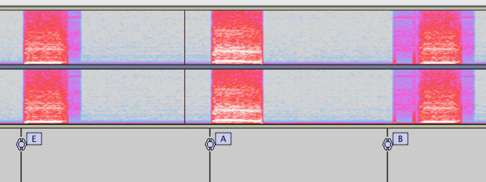

## Phonic Frenzy 2

This is a continuation where the head-unit has now been locked down so that the special features are only available if the correct wiring harness is detected. Wiring harnesses usually are just made up of passive components (i.e. wires), so this should be a simple matter of detecting the input pins and then "playing mastermind" by connecting each output in turn and in all combinations back onto the RHME3 inputs.

Of course, that is the easy way. And we don't do things the easy way.

By looking at the signals being generated by the target firmware on the board we can see that the outputs are on the A[0..5] pins; and there is [still audio on the D7 and D8 pins](phonic_frenzy_2/phonic%20frenzy%202.flac)

```
Welcome to the infotainment center
Verifying that the secure hardware interface is connected correctly
This unit has been dsiabled for security reasons
The wiring harness appears to be connected incorrectly
<pause>
IO Block frequency is inconsistent
IO Pulse inverted line is not connected correctly
Please check the wiring

The system will reboot now
```

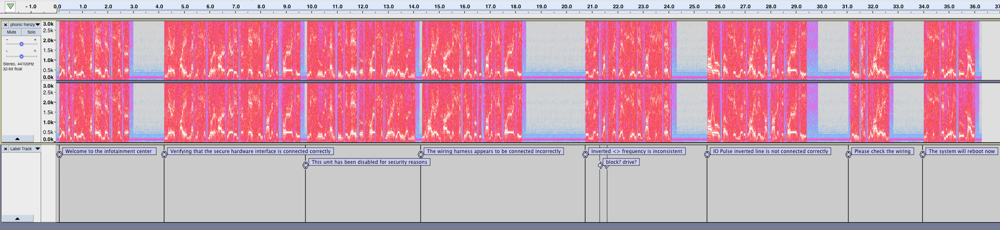
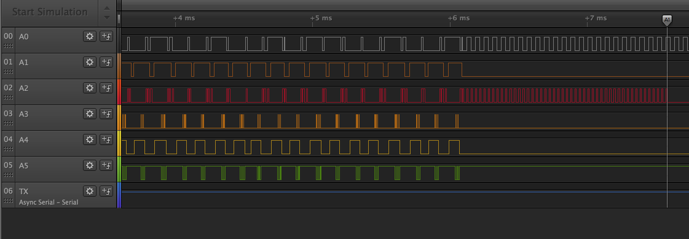

So the game we played (and played, and played) was connecting the A[0..5] outputs up to the other D[2..6,9..13] pins. When something useful changed in the wiring, the target firmware would 'reward' us with a change to the errors enumerated (see the list after the `<pause>` above).

We built tables of connections attempted

```
| pin     | pin | function-name sink (+ for confirmed)| note      |
|---------|-----|-------------------------------------|-----------|
| A0      | D2  | IO prepare line (/ orinverted clock?)   | could be A0,A2,A4 |
| A2      | D3  | block frequency indicate line (+)   | could be A0,A2,A4 |
| A1 (+)  | D4  | audio active line (+)               | not A4, A2, or A0|
| A5 (+)  | D5  | IO pulse inverted line (+)          | not A3    |
|         | D6  |                                     |           |
| A3 (+)  | D9  | IO pulse line (+)                   | not A5    |
| A4 (+)  | D10 | IO bridge line (+)                  | not A0 / not stable with A2|
|         | D11 |                                     |           |
|         | D12 |                                     |           |
|         | D13 |                                     |           |

can't find a combination to stop "inverted block frequency is inconsistent" and/or "block frequency does not match inverse"

disconnecting D2 -> "clock frequency does not match inverse"
conecting D2+A0 -> "inverted clock frequency is inconsistent"
```

Then, when those tables got too big, we adapted (by using bigger tables):

```
| connection  | input name     | [@1a] | [@1b] | [@1c] | [@3a] | [@2a] | [@2b] | [@2c] | [@2d] | Notes |
|-------------|----------------|-------|-------|-------|-------|-------|-------|-------|-------|-|
| none        |                |  X    |       |       | X     |       | X     |       |       | |
|   A3 -> D3  | inv clock?     |       |       | ~     | X     |       | X     |       |       | |
| + A1 -> D4  | audio active   |       |       |       |       |       | X     |       |       | |
| + A5 -> D5  | io pulse inv   |       |       | ~     |       |       |       | X     |       | |
| + A4 -> D10 | io bridge      |       |       | X     |       |       |       |       |       | |
```

We got the error messages down to the point where the target FW would always complain about a problem with the 'clock inverse'. We reasoned that even though cable harnesses are made of passive components an active solution was needed. We put together an inverter from an XOR and tried using it to produce the 'clock inverse' that the speak and spell was demanding we sacrifice in its name...

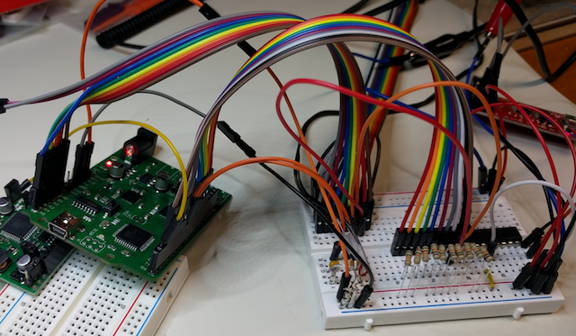

We tried many pins and combinations with that inverter in place. Then... of course, more tables. We simply couldn't find the inverted clock signal or even create it. We may have let the tables get a little out of hand...

```
| D2  | D3  | D4 | D5 | D6 | D9 | D10 | D11 | D12 | D13 | RX  | Vin |                                | [@1a] | [@1b] | [@3a] | [@2a] | [@2b] | [@2c] | [@2d] | [@2e] | [@1c] | Notes |
|-----|-----|----|----|----|----|-----|-----|-----|-----|-----|-----|--------------------------------|-------|-------|-------|-------|-------|-------|-------|-------|-------|-|
|     |     |    |    |    |    |     |     |     |     |     |     |                                |       | X     |       | X     |       | X     |       | X     |       | |
| A3  | A5  |    |    |    |    |     |     |     |     |     |     |                                |       |       |       | X     |       | X     |       |       | X     | |
| A2  | A5  |    |    |    |    |     |     |     |     |     |     |                                |       |       |       | X     |       | X     |       | X     | X     | D2 maybe pulse line |
| A0  | A5  |    |    |    |    |     |     |     |     |     |     |                                |       |       |       | X     |       | X     |       | X     | X     | |
|-----|-----|----|----|----|----|-----|-----|-----|-----|-----|-----|--------------------------------|-------|-------|-------|-------|-------|-------|-------|-------|-------|-|
|     |     |    |    |    |    |     |     |     |     |     |     |                                |       | X     |       | X     |       | X     |       | X     |       | |
|     |     |    | A5 |    | A3 |     |     |     |     |     |     |                                |       | X     |       | X     |       | X     |       |       |       | |
|     |     |    | '' |    | '' | A4  |     |     |     |     |     |                                | X     | ~     |       | X     |       |       |       |       |       | |
|     |     |    | '' | A0 | '' | ''  |     |     |     |     |     |                                | X     | ~     |       | ~     |       |       |       |       |       | |
|     |     |    | '' | A1 | '' | ''  |     |     |     |     |     |                                | X     |       |       | X     |       |       |       |       |       | |
|     |     |    | '' | A2 | '' | ''  |     |     |     |     |     |                                | X     | ~     |       |       |       |       |       |       |       | |
|     |     |    | '' |    | '' | A0  |     |     |     |     |     |                                | X     | ~     |       | X     |       | ~     |       |       |       | |
|     |     |    | '' |    | '' | A2  |     |     |     |     |     |                                | X     | ~     |       | X     |       |       |       |       |       | so either A2 or A4 are OK on D10 |
|     | A0  |    | '' |    | '' | ''  |     |     |     |     |     |                                |       | X     |       | X     |       |       |       |       |       | |
|     | ''  |    | '' | A2 | '' | ''  |     |     |     |     |     |                                |       | ~     |       | X     |       |       |       |       |       | D6 might be a clock line |
|-----|-----|----|----|----|----|-----|-----|-----|-----|-----|-----|--------------------------------|-------|-------|-------|-------|-------|-------|-------|-------|-------|-|
|     |     |    |    |    |    |     |     |     |     |     |     |                                | X     | ~     |       | X     |       | X     |       | X     |       | |
| A4  |     |    |    |    |    |     |     |     |     |     |     |                                |       |       |       | X     |       | X     |       | X     | X     | |
| ''  | A4  |    |    |    |    |     |     |     |     |     |     |                                | ~     | X     |       | X     |       | X     |       | X     |       | inverted clock line is D3? |
|     | ''  |    |    |    |    |     |     |     |     |     |     |                                |       |       |       | X     |       | X     |       | X     | X     | |
| A3  | A3  |    |    |    |    |     |     |     |     |     |     |                                | ~     | X     |       | X     |       | X     |       | X     |       | |
| A3  | A5  |    |    |    |    |     |     |     |     |     |     |                                |       |       |       | X     |       | X     |       | X     | X     | |
| A5  | A3  |    |    |    |    |     |     |     |     |     |     |                                |       |       |       | X     |       | X     |       | X     | X     | |
|-----|-----|----|----|----|----|-----|-----|-----|-----|-----|-----|--------------------------------|-------|-------|-------|-------|-------|-------|-------|-------|-------|-|
| A3  |~A3  |    |    |    |    |     |     |     |     |     |     |                                |       |       |       | X     |       | X     |       | X     | X     | |
|~A3  | A3  |    |    |    |    |     |     |     |     |     |     |                                |       |       |       | X     |       | X     |       | X     | ~     | no @1c on first boot |
|~A2  | A2  |    |    |    |    |     |     |     |     |     |     |                                |       |       |       | X     |       | X     |       | X     | ~     | no @1c on first boot |
|~A1  | A1  |    |    |    |    |     |     |     |     |     |     |                                |       |       |       | X     |       | X     |       | X     | X     | |
| A1  |~A1  |    |    |    |    |     |     |     |     |     |     |                                |       |       |       | X     |       | X     |       | X     | ~     | no @1c on first boot |
| A1  |~A1  |    |    | A0 | A3 | A4  |     |     |     |     |     |                                |       |       |       |       |       |       |X      |       |       | no @1c in later cycles |
| A1  |~A1  |    | A5 | A0 | A3 | A4  |     |     |     |     |     |                                |       |       | X     |       |       |       |       |       | X     | |
| A1  |~A1  | A1 | A5 | A0 | A3 | A4  |     |     |     |     |     |                                |       |       |       |       |       |       |       |       | X     | |
|~A2  | A2  | A1 | A5 | A0 | A3 | A4  |     |     |     |     |     |                                |       |       |       | X     |       |       |       |       | X     | |
|~A3  | A3  | A1 | A5 | A0 | A3 | A4  |     |     |     |     |     |                                |       |       |       | X     |       |       |       |       | X     | |
|-----|-----|----|----|----|----|-----|-----|-----|-----|-----|-----|--------------------------------|-------|-------|-------|-------|-------|-------|-------|-------|-------|-|
```

As it turns out, _tables_ were never going to save us from this monotonous beast! Just RTFM would: let's take a look at the schematic...

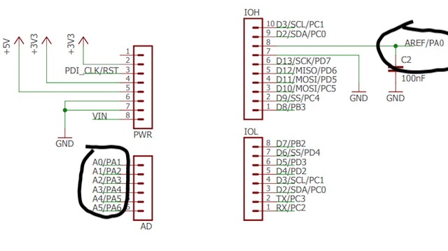

The silkscreen says AREF, but that pin is the last one in the set of pins creating the A[0..5] signals! Connecting it to the D2 pin resolved all the errors and then the target spoke the flag! Then, just like last time we had to use a filter and examine the letters in the frequency domain to get them right; but we did.

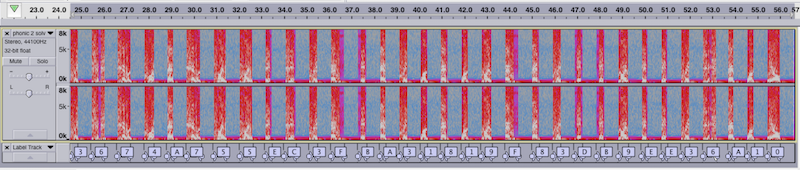

## Car Key Fob Hardware Backdoor

In this challenge, we know that there are some pins which are being used to emulate a *scan chain* and that we need to figure out the challenge/response protocol in order to get the flag.

```
We reverse engineered the firmware of a key-fob we found. There is an indication that there is a backdoor in a hardware module through a scan-chain that provides access to all the cars. It appears to use pin 1, 2, 43, and 44 from the chip. It also has a challenge-response mechanism of 128-bits. A list of possible password candidates is found in the firmware and printed below.

PS. The scan-chain is emulated in software. Therefore, the worst case branch takes around 0.54 ms, and therefore you shouldn't drive the clock faster than 1.8 khz.

princess
fob
qwerty
secr3t
admin
backdoor
user
password
letmein
passwd
123456
administrator
car
zxcvbn
monkey
hottie
love
userpass
wachtwoord
geheim
secret
manufacturer
tire
brake
gas
riscurino
delft
sanfransisco
shanghai
gears
login
welcome
solo
dragon
zaq1zaq1
iloveyou
monkey
football
starwars
startrek
cheese
pass
riscure
aes
des
```

(That challenge description changed a couple times over the course of the RHME3 competition, along with hints being added and corrected too, but let's start with this description). As mentioned above, this was a multi-month endeavour; there a mix of doing things the hard way, making dumb mistakes and also a bugged challenge.

### In the beginning, there was JTAG (right?)

Given the description of a bunch of pins on the RHME3 target as constituting a *scan chain* we did what any self-respecting HW reverse engineering practioner would do: jtagulate it.


The jtagulator didn't want to go slow, so we cooked up [a patch](https://github.com/grandideastudio/jtagulator/pull/16) -- which Joe says he's going to integrate in his own way :). We patched our jtagulator and jtagulated the RHME3 CKF HW Backdoor target.

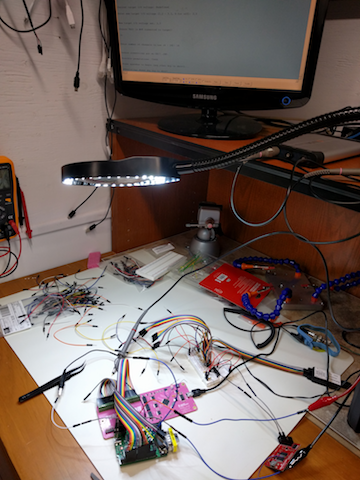

The Riscure devs had put a fun trap into the challenge: it would issue a self-destruct.

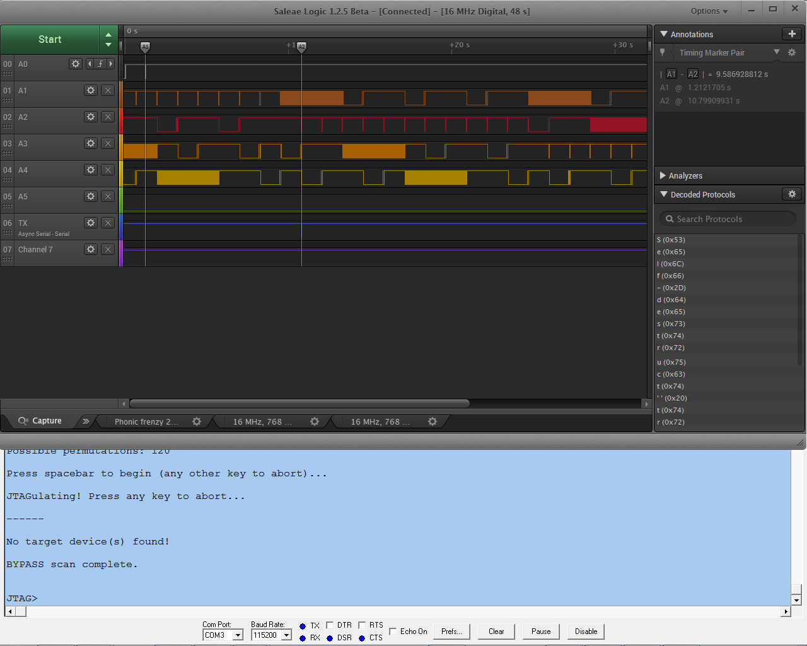

```
Self-destruct' 'triggered.\r\n5\r\n4\r\n3\r\n2\r\n1\r\nBOOM!!!\r\nFake' 'explosion.' 'I' 'hope' 'it' 'scared' 'you' 'away\r\n
```

We later learned that this was happening only when a particular bit was asserted during shift-in and latch (see below). But the net effect here was that any time we tried to JTAGulated the target, it would emit this self-destruct! Fun.

#### Into Darkness

We poked blindly at the target for some time; exploring with the long sentinel value.

We were able to determine that the response needed to be shifted-in to the target (aka 'sent') during 'frame B' (called quad B below). Because the last frame, 'frame C' was too short. At this point we were still thinking of this as being a software implementation of a state-machine representing shift-registers in a virtual scan chain, i.e. emulating the electronics of it.

> recap: each time we 'latch' some bits (ideally read the circuit into the SR, but practically this appears to also virtually write the virtual SR into the circuitry as well) we'll call that a frame. we've explored all the bits of frame A; it is 512 bits wide, there are some read-only bits, a couple bits that trigger self-destruct (with and without countdown) and finally also a bit that causes a 128bit randomized value to be emitted in frameB -- the instigate bit. We divide up each frame into 128bit quadwords, enumerating from MSB first: quadA, quadB, quadC, quadD. The read-only bits are spread across quadB and quadC. quadD contains the self-destruct bits; quadC contains the instigate bits.
> 
> When we shift bits during a frame, we also shift-out bits from the Shift Register; in frameB quadA shifted-out contains the randomized value, presumably a nonce. quads B,C,D contain the contents of what was shifted-in during frameA -- except as modified by the read-only bits which are stuck at 0.
> 
> In frameC, all the quads shifted-in during frameB will be shifted out almost (more in a sec); however, it is no longer possible to shift-in any data as bits shifted in will no longer propagate *through* the SR to the end of the chain and out again. In frameC t 512-25 clocks into frameC, the target prints `Test mode activated`. This is presumably a soft reset condition since this is what is printed when the target comes out of reset. (edited) 
> 
> questions I don't think I know the answer to, which I thought of in writing the summary: 1) does the SR still wrap-around in frameB ? 2) are the read-only bits still stuck at zero in frame C ?

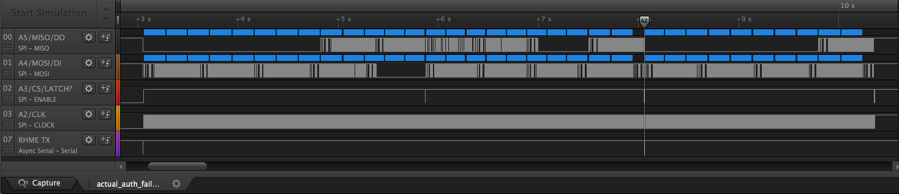

Looking-back, we were still very wrong about some things. But we had reverse engineered that there were three frames: A, B and C. Where frame A and B were 512 bits and frame C was only 384 bits. In frame A you could shift-in a bit asserted, the 'instigate' bit and in frame B you would receive a 16 bytes challenge shifted-out at bit offset 0. In frame B you could shift-in with a bit asserted and received `Authentication Failed`, the 'authenticate' bit. We had eliminated frameC as being anything but where the response would be shifted-out.

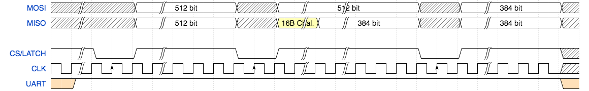

So we were fairly certain that the response needed to be sent in frame B along with the authenticate bit set. But at what offset, and how should the response be calculated from the given challenge? We tried to put the response in various places, using a variety of combinations of algorithm, password-preparation, bit offset in the frame, password selected and frame. We developed an over-engineered piece of python which would search exhaustively through all the possible combinations even.

[cr_methods.py](car_key_fob_hardware_backdoor/cr_methods.py)
[frames_protocol.py](car_key_fob_hardware_backdoor.py)
[send_many_responses.py](car_key_fob_hardware_backdoor/send_many_responses.py)

#### PPS

No one was getting anywhere on this challenge, it wasn't just us. We were bugging Riscure in DMs on Telegram (thank you, Alex), and aparently so were many others. Riscure revised the challenge description and added a 'PPS' as a hint.

> PPS. The Encryption used by this key-fob is very Advanced.

Which helped reduce the search space some, but we were already considering AES algorithms in our searches.

#### More PPS

We were given a hint that the password is a two-word combination from the list of combined length 16.

At this point we were so sure we had the righ parameters that we would get the flag if we just completed an 8 hour search

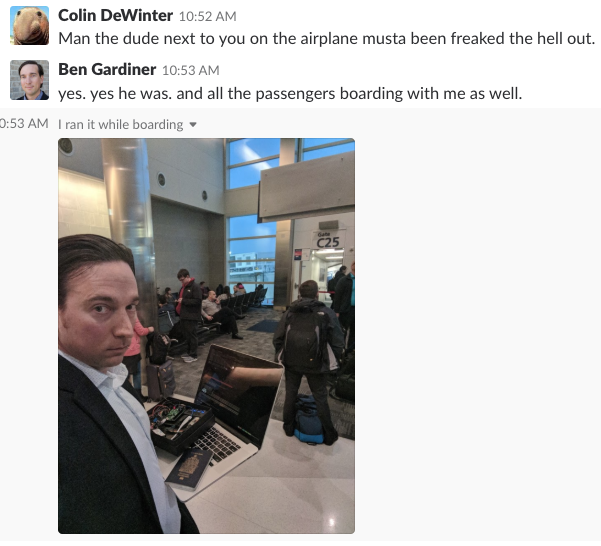

So I kept the search running while I boarded my Delta flight home one night. Not the greatest idea I ever had... no, we did not get the flag.

#### PPPS

We got another hint on the challenge page:

> PPPS. Remember that the bits in the output of the scan chain come in reverse order. Also, the location for the provided plaintext is different from the one where the challenge is received.

Didn't help us much though since were were already 'searching' through all bit orders and bit positions that were possible without intersecting the 'stuck bits.'

#### Stuck Bits ?

We did notice that the data shifted-in in 'frame A' would shift-around to us in 'frame B' -- which is consistent with scan-chains. But *some* bits would get 'modified.' There were also some bits that were 'control' bits -- we referred to all of them roughly as stuck bits.

We were wondering if these stuck bits were point us to where we shouldn't put our response to the challenge -- we operated under that assumption: that we needed to avoid these bits, because at least one of them would cause a self-detruct if set. But at this point, we were questioning everything.

> Ben Gardiner [11:07 AM]
> There are 1) stuck bits 2) control bits 3) self-destruct bits ; only quadC has control bits ; only quadD has self-destruct bits. we cannot ignore self-destruct bits. We could try to ignore control bits. We could try to ignore stuck bits.
> 
> quadB:
> * ignore stuck bits (already done in other runs)
> * avoid stuck bits (move to next password)
> quadC:
> * ignore control bits, ignore stuck bits
> * avoid control bits (next password), ignore stuck bits
> * ignore control bits, avoid stuck bits (next password)
> * avoid both (next password)
> quadD:
> * ignore control bits, avoid self-destruct bits (already done in other runs)
> * avoid both (next password)

We tried all. And -- as you can probably guess by now -- nada.

Also: Perhaps we were supposed to supply a response _in_ the bitfield containing some stuck bits; and if the target were using AES decrypt for the CR algorithm, then we would need plaintexts that had the bits avoided. We got a whole pile of challenges; assumed that they were aES ciphertexts and decrypted them with all possible passwords (which we now knew from the hints). But saw no pattern of bits unset in any of them. So it clearly wasn't the case that the response should overlap any stuck bits.

#### The Writeup

We were getting pretty frustrated and we weren't alone; Vtor (from the winning team in the end) was too.


On April 4th we contacted Alex @ Riscure because we had done all the obvious stuff and nothing was working.

> darn. nothing came of a search through 6200 possibilities last night.
> 
> the code I'm using has evolved over the past couple months so it's going to take a bit to get you up to speed on it
> 
> [test_cr_methods.py](car_key_fob_hardware_backdoor/test_cr_methods.py)
> 
> first up: that is a test of the Challenge-Reponse methods I've implemented. Since the 'PS' added to the challenge I've been using only aes_ecb, decrypt.
> 
> the 'sequence' of what get's shifted-in, shifted-out is probably best captured in the following snippet:

```python
def try_frameB_response(password_bytes, password_prepare, message_responder, frame_responder, name=None):
  serial_handler = reset_on_sd_serial_handler
  serial_output = bytearray(b'')

  if name is None:
    name = str(password_bytes)+str(password_prepare)+str(message_responder)

  log("\n%s" % name)

  frameA_rx = quick_instigate_challenge(serial_handler)
  if frameA_rx is None:
    return None

  challenge_sequence = single_frame_send_and_receive(bitstring.BitString(hex='00'*16))
  ok, line = get_and_handle_serial(serial_handler)
  if not ok:
    return None
  serial_output.extend(line)
  log("challenge:  %s" % challenge_sequence.hex)

  password_sequence = password_prepare(bitstring.BitString(password_bytes))
  log("password prepared :  %s" % password_sequence.hex)

  message_response_sequence = message_responder(password_sequence, challenge_sequence)
  log("response :  %s" % message_response_sequence.hex)
  frame_response_sequence = frame_responder(message_response_sequence, challenge_sequence)


  pin_high(TRIG_OUT) # interesting stuff happens in frameB here

  single_frame_send_and_receive(frame_response_sequence)
  pin_low(TRIG_OUT) # interesting area over now

  ok, line = get_and_handle_serial(serial_handler)
  if not ok:
    return None
  serial_output.extend(line)

  log("end frame")
  single_clk_pulse()

  ok, line = get_and_handle_serial(serial_handler)
  if not ok:
    return None
  serial_output.extend(line)

  result_sequence = single_frame_send_and_receive(bitstring.BitString(bin='0'*512))
  log("end frame")
  single_clk_pulse()
  ok, line = get_and_handle_serial(serial_handler)
  if not ok:
    return None
  serial_output.extend(line)

  if len(serial_output.decode('utf-8').strip(' \t\n\r')) == 0:
    log("WARNING: no output on serial")

  if ((not 'Authentication failed' in serial_output.decode('utf-8')) and (not 'Self-destruct triggered' in serial_output.decode('utf-8'))) or (result_sequence != blanksss):
    log("=====================================================================================")
    log("FLAG (???)")
    log("result   : %s" % result_sequence.hex)
    log("=====================================================================================")
    with open('flags.txt', 'a') as the_file:
      the_file.write("\n%s\n" % name)
      the_file.write("challenge: %s\n" % challenge_sequence.hex)
      the_file.write("response : %s\n" % message_response_sequence.hex)
      the_file.write("result   : %s\n" % result_sequence.hex)
      the_file.write("serial   : %s\n" % serial_output)
  return
```

> when I 'search' I call this function many times with varied parameters. Since the 'PS' was added and you clarified it was two words combined, password has only ever been one two-word combined list set to 16bytes and password_prepare has been only pad (which does nothing for 16byte passwords).
> 
> I can create variations of the challenge-response routines as you'll see in the tests; message_responder in the snipped is one of the basic routines wrapped in some combination of bit-reversal (I have reverse across the whole frame, bytewise reverse, wordwise, longwise and also reversing of those -wise reverses), argument swapping (e.g. ciphertext/key swap) and a 'trivial' wrapper which leaves the routine unchanged
> 
> frame_responder creates a 512bit sequence with the authenticate bit set (the bit after MSB-wise the challenge-instigate bit). It also writes the response into different areas depending on which version is instantiated. Last night, e.g. I was searching through the space of writing the response such that the 128bit sequence either started or ended at offsets 192,196,200,201,202,203,204.
> 
> [just_128bit.logicdata](car_key_fob_hardware_backdoor/just_128bit.logicdata)
> 
> here is a logic capture that is relevant. It is not from last nights run where I was putting the response into the offsets I mentioned; rather it is a capture of putting the response (all 0xCC...CC as a sample) into offset 0 MSB-wise.
> 
> finally; here is an example of how I call that frameB_response function; this is exploring putting the start of the response at 196; through some bitreversals but no argument swapping

```python
def try_frameB_offsets_dontforget196():
  attempts = list()

  for offset in [196]:
    frame_responder = get_msb_offet_and_auth_responder(offset)
    for variant_responder in [get_rev_responder, get_trivial_responder, get_bitswapped_responder, get_rev_bitswapped_responder]:
      for argsorder_responder in [get_trivial_responder]:
        for password_prepare in [pad_password]:
          for operation in [decrypt]:
            for cipher in [aes_ecb]:
              passwords = get_16byte_pair_passwords()
              passwords.extend(get_16byte_pair_password_repeats())
              for password in passwords:
                attempts.append([password, password_prepare, variant_responder(argsorder_responder(get_cipher_message_responder(operation, cipher))), frame_responder, str(frame_responder.__name__)+'(%d' % offset +')'+'/'+str(variant_responder.__name__)+'/'+str(argsorder_responder.__name__)+'/'+str(password_prepare.__name__)+'/'+str(operation.__name__)+'/'+str(cipher.__name__)+'/'+str(password)])

  start = 0
  for i in range(start, len(attempts)):
    password, password_prepare, message_responder, frame_responder, name = attempts[i]
    log("%d of %d" %(i, len(attempts)))
    try_frameB_response(password, password_prepare, message_responder, frame_responder, name=name)
    i = i + 1
  return
```

> right... and here's a log of the search through the ~6200 last night
> 
> [send_many_responses.log](car_key_fob_hardware_backdoor/send_many_responses.log)
> 
> so... I hope that gives you enough detail to confirm/answer your questions. I still haven't tried some things: things 1) byte,word,long-wise swapping&reversing for lsb-offset, 2) argument swapping for any 3) other offsets overlapping with bit 203 (maybe they don't check the 'first' bit at all 4) word,long-wise swapping&reversing for msb-offset . also didn't try assuming the riscure tool reports bit numbers LSB-first. So I'm not out of options yet


#### Side-Channel ?

Left scratching our heads; we started thinking laterally: maybe we needed to use side channel analysis. We now knew (from the hints that were slowly released) that the target was performing AES-ECB as the challenge-response algorithm. We couldn't figure out what the key was or where to put it in the frame. a) Perhaps, with side channel analysis we could extract (via leakages) the key being used in AES for the response validation on the target? b) Perhaps we could detect the bit position where the response needed to be located by looking at input data correlations?

We had alot of fun getting the setup for this one going. First I made a chipwhisperer module that could drive the target using the same python bitbanging. I wrote my bitbanging driver in python3 (like a sucker) so; what I did was create a CW driver that connected over TCP to a server-version of my python3 bitbanging code.

Triggering is super-important when doing power analysis. The target is implementing some kind of state machine that triggers on CLK edges (because it is pretending to be SPI and that is what synchronous serial is). We wanted to look at power traces across an entire challenge-response sequence of transferring over 1024 bits, at a very low bitrate and we need to sample at a high rate to see the power traces. So we want to selectively trigger on one of a particular CLK edge in that over 1024 set. The chipwhispered has a logic-combining trigger mode, so I could add another GPIO line as 'gate' for triggering.

a) This worked well; we explored the power traces of the target at the point where we 'latch-in' data.

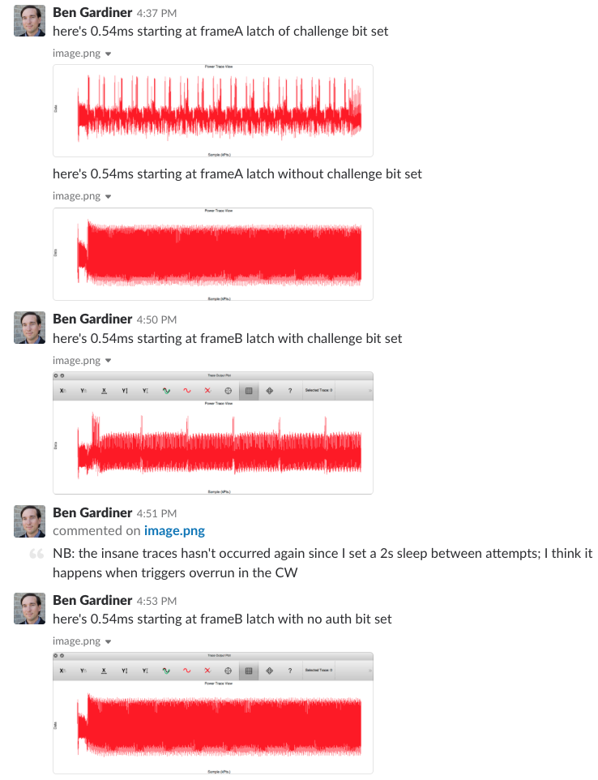

We also explored the power traces at each of the CLK edges in the frame -- in case the response for comparison was being pre-computed.

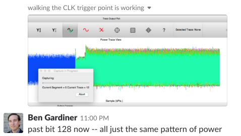

But I had to stop.

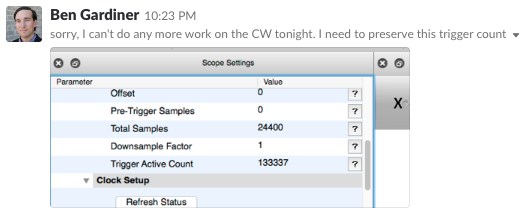

b) this method did discover _something_, just not the bit-offset where we need to put the response.


This is the input data correlation bitwise; the point in time we're looking at is right after we 'latch' the data into the target for 'frame B'. The large swings in correlation on bit 203 are suggesting that there is a time execution dependence on the value of bit 203. Offset 203 (as first or last bit) did not yield success with any of the response calculation methods in our arsenal at this point.

#### The LED ?

We discovered a fun fact; one of the bits shifted-in (bit 203 in quadB) were controlling the LED. This pushed me back to thinking about the SW scan-chain as implemented boundary scan. I connected up a logic analyzer to as many DIO pins as possible and ran a script to explore all the bits around the one that we knew controlled the LED. This -- of course -- turned up nothing, nada. I would repeat the process: move the probes to new pins and run the script again.

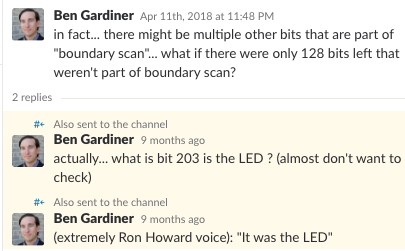

There was no boundary scan implemented here, just that one LED control bit. Probably put there just to troll people like me who *really wanted* it to be JTAG.

#### The Last Straw

On April 9th (2018) we contacted Alex again:

> Hi Alex, I'm sorry to report that we haven't been able to convert all your help into something useful . Lots of the known space searched, but no flags. We think that either 1) we need to do something special in packing the response to avoid the stuck bits (the ones that read-back zero after a latch) or 2) there is a password-preparation routine that needs to be applied to the concatenation of the two words from the list before using it as an AES key. We think we can figure out 2 by SCA on the target during the operations is performs when the challenge bit is set -- so far we're just getting slowed down by our tooling setup requiring the CW instead of the picoscope for this challenge. I hope to remove that restriction today and get a better look at AES during latch of the challenge bit.

[summay.md](car_key_fob_hardware_backdoor/summary.md)

#### The Solution

Sorry, reader. I honestly don't know :)

It turns out that the challenge binaries which were made available for download were different than the binaries that they tested for the challenge. This is somewhat understandable though -- recall that the challenges are individually encrypted for each board. SO... the testing we were doing against our RHME3 board was different than the verification that poor Alex was doing on his end. He eventually got back to us with the good/bad news:

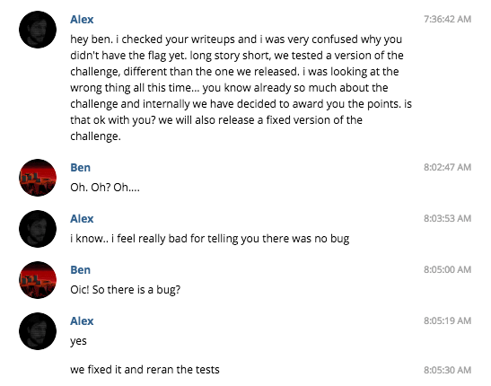

In the end we were given the solve and gold (retroactively even) for all the efforts. I never went back to re-run the search against the challenge. We were still in the competion and had a shot, so we moved right-away into fault-injection. So I don't actually know what the solution is. One thing is for sure; the correct algorithm, bit-order, password-prep, bit offset and password-pair combination is somewhere in the massive search code we put together.

This was alot of ups and downs and frustrations. Despite all that, I still enjoyed the challenge and I think riscure handled the situation as best they could. Special thanks to Alex Geana at Riscure for that. Maybe someday I will go back and re-run my search code on the patched binary... (probably not).
