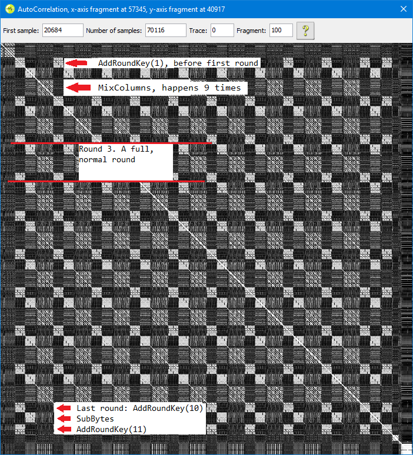

# Introduction
  * TODO: todo items remain below. (remove this one last)
  * TODO: write this section

# Categories
## Reverse Engineering
  *  50 [Ransom](#ransom-and-ransom-20)
  * 150 [Ransom 2.0](#ransom-and-ransom-20)
  * 250 [Full Compromise](#full-compromise)
  * 500 [Car Crash](#car-crash)

## Exploitation
  * 100 [Unauthorized](#unauthorized)
  * 200 [Bluetooth Device Manager](#bluetooth-device-manager)
  * 750 [Climate Controller Catastrophe](#climate-controller-catastrophe)

## CAN Bus
  * 150 [Can Opener](#can-opener)
  * 250 [Back To The Future](#back-to-the-future)
  * 500 [Auto-psy](#auto-psy)

## Side Channel Analysis
  * 200 [It's A Kind Of Magic](#its-a-kind-of-magic)
  * 350 [The Imposters](#the-imposters)
  * 500 [Random Random Everywhere](#random-random-everywhere)

## Fault Injection
  * 300 [The Lockdown](#the-lockdown)
  * 500 [Benzinegate](#benzinegate)

## ¯\\_(#ツ)\_/¯
  * 100 [Race Of A Lifetime](#race-of-a-lifetime)
  * 100 [Phonic Frenzy 1](#phonic-frenzy-1)
  * 200 [Phonic Frenzy 2](#phonic-frenzy-2)
  * 500 [Car Key Fob Hardware Backdoor](#car-key-fob-hardware-backdoor)

# Reverse Engineering

## Bootstrapping XMEGA Static Analysis in IDA Pro

At the beginning of the challenge, we had some fun 'bootstrapping' our ability to reverse-engineer XMEGA code. Our initial experience with both IDA Pro and radare2 was that the disassembly was sane, but what we really wanted was cross-refs. Especially desired in the beginning was cross-refs to the serial ports memory-mapper registers -- that way we could really start to understand where the `ransom` binary was making calls to printf. As we struggled with creating IDA Pro databases that had useful cross-references we also found how to get function signature matching working. Then later as we improved on reverse-engineering XMEGA code, we also created a way to have stack variables in our IDA Pro databases too.

Atmel come Microchip publishes specifications for most of the programming interface of their microprocessors as xml files, so-called `.atdf` files. Parsing these files to create useful IDB databases is an idea we stole shamelessly from a few cases of prior art:
  * https://github.com/abcminiuser/gdp/blob/c15f7f7bc545c321bd9956f0701e628b170e047f/devices/device_atmelstudio.py
  * https://github.com/wrightflyer/test/blob/fd17c7e0810f2fede0fd658406144d578b531b58/avrread.py
  * avrports.fsx from the radare2 github issue on xmega

The script we created, `avr2idacfg.py` started from modifications to the `avrread.py` script by Cliff Lawsom. Whereas his script creates header files, our script creates an IDA `.cfg` file which needs to be installed into `./~idapro/avr2idacfg.py`. At which point, a new target will be available when opening a `.hex` file in IDA.

This `.cfg` is really useful to name some of the memory addresses and interrupt handlers in the `.idb`; but there are some quirks of the IDA ATMEGA target when it is applied to an XMEGA target. First up is the fact that the XMEGA doesn't have the register file mapped at 0x0 in RAM but the ATMEGA target module of IDA is forcing naming these locations. I think it would have been possible to write and compile a new target module for IDA, but we hacked together some python to fix up the quirks of XMEGA on the ATMEGA target module: `fix_IDA_xmega128a4u.py` We ran into one weird quirk which we needed special handling for, but we were able to also capitalize on: the first 0x20 bytes of RAM can't be renamed from the `r0`, `r1`, ... given to them by the IDA target module to the ioport names that they actually correspond to in XMEGA because the names of these addresses are used as the register names in the disassembly. So we just added a comment on the address indicating what ioport it corresponded to. But, since the names of the addresses get used for register names in the disassembly, we were able to get some nice sugar in our disassembly: renames of the X, Y, Z data vectors `XL`, `XH`, `YL`, `YH`, `ZL`, `ZH` -- the script `avr_data_vector_names.py` takes care of this.

We originally wanted to be able to leverage `idascript` to process the .hex files at the command-line in batches. But IDA requires user interaction for the XMEGA target arch. But the scripts were all written as `idascript`s anyways.

Now, since we're analyzing flat binary files (even though they are ascii-encoded .hex files) we will get best cross-reference results when we create segments for RAM and copy the DATA segment there as is done by the early loader-loops in pretty much all flat binaries like this; these steps can be done manually in IDA by adding segments and loading additional binary files but the process is fragile; we automated the steps in the `avr_loader_loop_copy.py` script -- which also handles the difference in the addressing of ROM and RAM in the ATMEGA target module of IDA. Using it will require a small amount of reversing the target to fine the loader loop and extract from it the start and end addresses of the copy loops via some basic manual analysis.

Then we could finally get to some xrefs. We weren't really sure that we could quickly implement any analysis passes to calculate the contents of data vectors at the time of a load instruction; so we settled for calculating the data vector contents at the time that they are populated and making xrefs at that position. The code emitted by the compiler in all the challenge binaries we looked at tended to always populate the data vectors by sequentially loading pairs of immediates into the register pairs. i.e. `ld r(X-1), #imm; ld rX, #imm`. The script `avr_dumb_seq_load_xrefs.py` takes care of that. These xrefs aren't perfect: they are associated to the line, not the arguments of the disassembly; so renames of the target of the xref requires a fixup pass of the source of the xrefs to correct for the new name, and there are helper functions in there to invoke in that eventuality.

An important step to take before unleashing auto-analysis on a flat binary file is to change the data type of the contents of memory to a default word size. This is embodied in the `codatafy` script by Craig Heffner. We created a similar utility script for our purposes: `avr_codatafy.py`

Finally, after quite some successful reverse engineering using the above scripts (and the signature matching approach detailed below) we ran into difficulty keeping all the local variables straight in the larger functions that needed to be reversed. The good news was that, in the compiler optimization level Riscure delivered us for the challenges, the stack frame was always set in data vector `Y`. We wrote a script to look for offset loads from `Y` and create local variables at those locations in the script `avr_stack_vars.py`

Using the above we could get very reasonable disassemblies of the .hex files; but we also wanted to avoid duplicating effort so we searched for ways to make signature matching work. We discovered that it can't be done with FLAIR/FLIRT through a hexrays forum interaction. We tried also the rizzo signature matcher from Craig Heffner, which did not perform well. But zynamics BinDiff did perform quite well. The only caveat was that it would only work in IDA 6.95; whereas IDA 7.0 was the only version that would import all the DWARF debugging information from XMEGA ELF files. This is relevant because to seed our analysis with some known functions, such as printf, we took the whackamole project from RHME2, built it with Atmel studio (tweaking flags to get the emitted assembly to match the patterns we saw in the atarget binary) and then analyzed the resulting ELF file to get 'signatures' (via bindiff now)' for the common functions. Due to the quirk we needed to export all the names in a 7.0 idb into a 6.95 idb. But from then on we could check for library functions by using bindiff against that 6.95 whackamole idb and we could import previously analyzed functions from other challenges by similarly using bindiff against those IDBs.

For an example of how to use the collection of scripts, [`atxmega128a4u/scripts/`](atxmega128a4u/scripts/README.md)

## Dynamic Analysis

It was possible to use the Atmel Studio simulator. The .hex files could be converted into ELF files within the 'Device Programming' dialog of Atmel Studio and a 'simulator' could be selected instead of any physical debugger tools. It seemed like using dwarfexport would have been possible to get ELF files with symbol information exported from IDA into the Atmel Studio simulator debugger; however, we never actually tried to get this working, settling instead for comparing the two windows side by side for the times when we needed dynamic analysis.

We also did purchase some ATXMEGA128A3U chips already soldered-onto breakout boards as well as an Atmel ICE3 debugger. The A3Us turned out to be good choices for executing the clear firmwares, we were able to similarly use Atmel Studio to run .hex files on these targets via the ICE3. The ICE3 was a poor choice of debugger/programmer since only Atmel Studio was supported and not avarice or other more-open debugging bridges.

## Simulation

We simulated many of the provided .hex files using Atmel Studio. The simulator can't use .hex files, only .elf files, but it has a utility that can convert .hex files into .elf files. Here's the steps:
  1. Tools -> Device Programming -> Simulator / ATxmega128A4U
  2. Production file, Save to ELF production file, Flash: <target>.hex
  3. Tick the Flash box
  4. Save

And then to actually simulate:
  1. File -> Open -> Open Object File for Debugging
  2. Select the Object File To Debug: <target>.elf

The simulator is awful. Useful notes:
  * You can type in equations into the "jump to program address" bar at the top. If you want to check out sub_632, type in `2*0x632`, that'll put you where you want to be.
  * Similarly, type equations into the watch window. You'll often want ones like `r24+256*r25`
  * You can modify program memory in appropriate pane, but it's often easier to patch the .hex file using IDA or the .elf file using r2.
  * When searching for help, know that Atmel Studio is a modified version of Visual Studio, so the resources for the latter often apply.
  * The simulator is _WAY SLOWER_ than the actual board. I'm estimating a factor like x10000. Serious. Many challenges incorporate anti-FI checks and anti-RNG-pinning checks that will take literally hours in the simulator. Patch them out before you start.
  * Serial I/O just doesn't work. Set a breakpoint on print functions and a watch on the place the string will show up.
  * For input functions, break just before entry and manually key the desired string into the buffer the function will populate.

## Ransom and Ransom 2.0
[Detailed Notes](ransom/notes.md)

This is the most straightforward reverse engineering challenge. Our RE framework wasn't very solid at this point, so the notes aren't as detailed as later challenges. We defeated primarily by simulation. The challenge takes a userid (that the board will print out on serial), and derives an unlock code from it. The .hex file we're provided doesn't have the userid included, so we waited until it read it out from EEPROM, and overwrote it with the code the board printed out.

Continuing the simulation, we captured the 16 byte stream the program derived from the userid, and used that as the unlock code.

Note: The first version of the challenge had a bug in it where it would only check the first digit of the provided unlock code. Trivial brute-force would defeat that.

## Full Compromise
[Detailed Notes](full_compromise/notes.md)

This challenge is a pig, and there's no way it's only worth 250 points. Reading the binary, there's a couple obvious "hidden" functions in the main input parsing loop. First, instead of running a "test", we can run a "risc". There's no reason to do so. Maybe the infoleak described below was only supposed to be present in "risc" runs, who knows? Second, if you type a '*', you get put into a funny mode, that leads eventually to the `flag_4d15()` function.

How do we navigate that path? Well, let me tell you...

In reverse order:
  1. We need to have submitted the right code. We can easily get the right code by simulating the `init_hash_102acf_4709()`, and checking what got put there. (Notation note: that function will `init` a global variable named `hash_102acf`, and the function's hex address is `0x4709`.)
  2. The password we submit is "processed" by a function `process_password_47cc()`. Which is just a busy wait with a counter of 500,000,000. Truth. That BS takes about six hours to loop. Apparently someone was a _little_ concerned about bruteforcing. (A 250 **byte** long fully random password, WTF)
  3. And we have to enter that password using pulse dialing. It doesn't matter what character we send (other than '*'), what matters is the delay since the last character. If you want the first character to be 0xa5, then send 165 characters, then wait ~6 seconds for the character to be accepted. Dialing at this speed, it takes about a half-hour just to clock the passcode in. (Fortunately, the board echos out the password it received, so you can check for errors).
  4. As if that wasn't enough, there are 1000 binaries. You need to figure out which passcode to use...

How to figure out which binary? That's where the 'test' command comes in. This function bitbangs the contents of a pair of arrays out through the DAC. However, those two arrays are constant across all binaries. Further examination shows that of the 100 entries 10 are modified slightly by a random slice of an array called `randombits_102a6b[]`. That array's contents vary per-binary. Here's what we did:
  1. Programmatically run the "test" command 200 times, capture the results with a scope, and export the scope results to .csv files. (We did this using [AutoHotkey](https://autohotkey.com/))
  2. Use a script to extract 10 bit sequences from the analogue scope results
  3. Use another script to collate them into a 110 bit long sequence
  4. Use [simavr](https://github.com/buserror/simavr) to simulate the function that generates the "randombit" arrays, for all 1000 binaries.
  5. Find out which one matches the string we got from the board.

Ok, that's all in place now, all that's left is to simulate the correct binary, find out the code, pulse-dial it into the board, wait six hours, and use `stdbuf -o0` so that we actually get to see the flag.

An easy 250 points. (lol wtf!)

## Car Crash
[Detailed Notes](car_crash/notes.md)

We have a simple command interface. Using it, we can print out the encrypted logs, and we can "decrypt" and print the "decrypted" logs. Only problem is, the "decrypted" logs are garbage.

Reversing quickly showed the existence of an unreferenced pair for the "decryption" function, meaning that the binary contains both encrypt and decrypt. I didn't recognize the algorithm, so I converted the disassembly into C, wrote a wrapper for it, and fixed it up so it built and ran. [Source](car_crash/crash.cc).

It didn't quite work at first, so I fired up the simulator, my code in gdb, and ran the two side-by-side and fixed my code to match the simulator. I did the same for the unused crypto function, by moving $pc in the simulator. Once I had an identically working copy in C, I reverse that instead of the AVR code.

Using a known plaintext, I reduced the algorithm to a single round, and printed all intermediates. I saw that in a round-trip, my plaintext->ciphertext->plaintext sequence diverged after the sbox step of decryption. Then I saw that some entries in the `inverse_sbox_102110[]` had been zeroed. Fixing that is trivial given the forward sbox, and immediately produced a clear decrypt of the logs.

# Exploitation
See [Reversing Engineering](#reverse-engineering-1) above for details. We followed the same procedure here.

## Unauthorized
[Detailed Notes](unauthorized/notes.md)

Initial reverse engineering showed the existence of a 'backdoor' account, with a 32 byte password hash. Just in case, we threw hashcat at it, but got no results.

Working backward from the flag printing function, the code searches through the list of configured users, if it finds a match, checks that the hash of the password matches the hash in the list using `strncmp()`, and if so prints out the flag. Rather than reverse the hash algorithm, we simulated it, giving it a known password, and checking the result against known algorithms. Unsurprisingly, it was off-the-shelf SHA256.

With this understanding in place, we went looking for a place to exploit. The only place our input is handled is in the function we named `parse_and_maybe_set_flag_printer()`. It does a bizarre dance summarized below:
  1. `alloca()` space for the two numbers, `memcpy()` them over and `strtol()` them.
  2. `alloca()` space for the password, but do nothing with it yet.
  3. `alloca()` space for the username, `memcpy()` it over, and search the list for a match.
  4. If it finds a match, `memcpy()` the password over, hash it and compare.

The code checks whether the numbers we submit are negative, but it doesn't check for int overflows. Which don't match, but gave us the right idea. By claiming the password is unusually long, we can cause the stack to grow until it overlays the heap. With a carefully chosen value, the value we submit as the 'username' will be written to an arbitrary place on the heap.

Using this, we choose a new password, hash it, and overwrite the backdoor accounts password hash with our hash. Then we log in. Flag.

## Bluetooth Device Manager
[Detailed Notes](bluetooth_device_manager/notes.md)

In this challenge, we get to interact with a simple interface that allows us to configure and modify a list of "connected" devices. This challenge took me much longer than it should have, because I didn't pay attention to exact function of the `brcc` and `brcs` opcodes. There's an off-by-one error in the function we named `broken_read_str_until_13b()`. Just from initial analysis we knew that it didn't always null-terminate, but thought that was it.

Also, we read the victory string: "such heap, much pr0!", and guessed that it might be an attack on `malloc()` or `free()`. I'd recently done a challenge where a broken `malloc()` implementation was the target, so I ended up fully reversing both those functions, to no avail. That was dumb. In the context of this challenge, I should have compared them to the known-good versions in other levels. It's not like Riscure would have deliberately left such a vulnerability in all levels.

Once we identified the correct vulnerability (the off-by-one error), we realized what that meant. The ability to overflow heap strings means the ability to modify the malloc entries between the heap strings. Details are in the linked notes file, but the summary is:
  1. Create heap strings A, B, C, D
  2. Delete B
  3. Overflow A to modify the size of B in the freelist, so that it overlaps with C
  4. Create a padding entry in the formerly-B-freespace to use up some
  5. Create a payload entry that overlaps the part of C. that contains the struct
  6. Write to the element created in 5 to alter where the struct points
  7. Write to C to write where the struct points.

All that done, we just need to tick the relevant boxes. Write `0xBAADF00D` to the relevant address, and overwrite a return address with the victory function.

## Climate Controller Catastrophe
[Detailed Notes](climate_controller_catastrophe/notes.md)

At 750 points, we expected this one to be rough, and we were not disappointed. We start the challenge out with one **major** hint. The organizers provided us with a .hex file that will wipe the contents of the EEPROM. Immediately this suggests to us that we can brick the challenge by writing bad values to the EEPROM, which turned out to be true. Going with this, we need to understand how we can write to the EEPROM, and how the board will react to the contents of it.

First things first, we need to interact with the board. The serial line just prints out some initialization messages then goes silent. No amount of prodding there produces a result. Breaking out a logic analyzer, and probing all the A# and D# channels, we saw traffic on D7, D9, D10, D11, and D13. Checking out the [board schematic](atxmega128a4u/resources/riscurino-1.0 - Schematics.pdf), we found that most of those lines are inputs to the CAN controllers. We spent a little while fuzzing the CAN interface, but got nothing. So instead, we read the SPI traffic on board init. From that we learned that it was masking all traffic except from a couple SIDs like 0x665, and was running at 100 kHz. Cool, we have interaction.

At this point we spent about a week reverse engineering the .hex file. Here's a list of the things we learned:
  * It accepts CAN traffic from 0x776 as well as 0x665
  * The flag printing function isn't called from anywhere, we're going to need to gain control of $pc.
  * Before we invoke that function, we need to set global variable `must_be_1337_10210A` to 0x1337, or else the flag will be masked.
  * There's a global we called `eeprom_write_lock_1020f0` that controls write access to the EEPROM. We need to satisfy a "Diffie-Hellman" challenge to get it.
  * They did DH wrong, the equation is `C = R^E (mod M)`, solve for 'E', but they ask us to solve for 'R'. To solve that all we need to do is factor the modulus, and use a well-known algorithm.
  * The "certificate" we can upload to EEPROM needs to satisfy a very particular format or else it will be wiped and replaced by the default.
  * We need to mark the EEPROM cert as "uninitialized" so that it gets parsed on startup.
  * The function `cert_check_valid_6297()` is called with a length 0x100 buffer, but internally it uses three length 100 buffers. The opens up an overflow of the third.

With the overflow point established, we need to build a ROP chain that will set `must_be_1337_10210A`, and invoke `print_flag_or_die_4E8F()`. The easiest target I saw was to return to the tail of an ISR, which is going to populate almost all of the registers. Once we had that, and a function like `sub_34e2()` that invokes `memmove()` near its return to get our write-what-where, it was all over.

Result: a board that prints the flag to serial on boot, every boot.

Funny story: The INT0_ ISR that we used for our first ROP gadget sets `r1` along with so many other variables, and I stuck `0x31` there as a placeholder... code starts to act _real strange_ when you change the value of zero...

# CAN Bus
All these challenges, (and [Climate Controller Catastrophe](#climate-controller-catastrophe)) use the CAN interfaces as a primary method of communication with the firmware on the board. The board has two CAN controllers, which are cross-linked through an on-board CAN bus, which is helpfully exposed through the DE9-ready ports near the barrel jack. The CAN controllers are programmed through SPI, which can be sniffed through the high D## ports.

Later on, we cut the traces connecting the two CAN controllers, and plugged a CAN2USB adaptor into each, then used an [ugly python script](back_to_the_future/ugly.py) to bridge the two. This allowed us to isolate them and test them separately, without their cross-chatter interfering. Note that since the whole system of "ECU"s is emulated in software, we need to have a CAN adaptor plugged into each side, or else the board will stop responding.

## Can Opener
[Detailed Notes](can_opener/notes.md)

This challenge really is a "CAN opener". The whole challenge is the following three steps:
  1. Connect to the CAN bus
  2. Observe one ECU sending regular 0x332 "lock\0\0\0\0" messages
  3. Send a 0x332 "unlock\0\0" message
Done.

## Back To The Future
[Detailed Notes](back_to_the_future/notes.md)

This challenge relied on the split CAN bus. Without it, conflicting speed messages kept preventing us from pinning the speedometer. If we saturate the bus enough that conflicting messages don't get through, we trip error states. So to pin the speed, we have our bridge script alter every speed message it sees to 88 mph.

That still doesn't work, because something is triggering the "check engine" light. From outside experience, we know that that light often is a generic "something is wrong" light. To find out what's up with it, we tried every message we saw and several variants of them to see what toggled the engine light off. Eventually we found that the 0x19a message was it. We didn't find out what it meant, or where to put it, so instead, we fired one off every time we saw any message. That was enough, and a few seconds later the flag fell out.

## Auto-psy
TODO

# Side Channel Analysis
  * TODO: overview

## It's A Kind Of Magic
[Detailed Notes](its_a_ko_magic/notes.md)

[Jlsca Notebook](its_a_ko_magic/rhme3-itsakindofmagic.ipynb)

From the challenge description, we (accurately) guessed that there was simple XOR masks on both input and output. Round-trip encryption/decryption cycles work, but not across reboots. That suggests the masks are randomly generated on boot. Next we used the excellent autocorrelation feature of the Riscure Inspector tool.

Now, I want to talk about the above image for a while, but autocorrelations are awesome, but not well explained. Contrary to what my labels on the image suggest, execution is on the diagonal. Every instant is perfectly correlated to itself, so we get a solid white diagonal line there. The square blocks we see on the diagonal are loops. In loops, the chip does the same thing over and over again, so each loop correlates well to all the other iterations. Note that even substantial differences in processed data don't have much effect. What's being shown here is what's being done.

With an unprotected software AES implementation like this, we can deduce what each part is just by counting. There are eleven AddRoundKey operations, ten SubBytes, and nine MixColumns. I've labelled the projection on to the left side because it was easier in Paint. I could have labelled the top, or (with a bit more work) the diagonal. Same thing. If you look a little more closely, you can see the MixColumns operation has a four-by-four grid structure. That's because MixColumns is implemented as a nested for loop.

To attack this implementation, we observe that there's no additional input or output masking step in the plot, and that there's no mathematical difference between XORing the mask to the plaintext/ciphertext, or XORing it into the first and last round keys of the schedule. Noting this, we do the equivalent of an AES-256 attack on this AES-128 implementation, because that involves capturing the first and second round keys. Then instead of trying to reconstruct an AES-256 key out of them, we throw away the masked first round key, and use the second one the derive the original key.

Check the notebook for a full walkthrough.

## The Imposters
[Detailed Notes](the_imposters/notes.md)

[Jlsca Notebook](the_imposters/rhme3-theimposters.ipynb)

TODO

## Random Random Everywhere
[Detailed Notes](random_random_everywhere/notes.md)

TODO

# Fault Injection
## The Lockdown
## Benzinegate

# ¯\\_(#ツ)\_/¯
## Race Of A Lifetime
## Phonic Frenzy 1
## Phonic Frenzy 2
## Car Key Fob Hardware Backdoor

